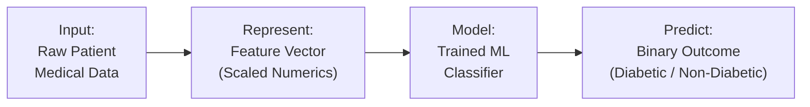
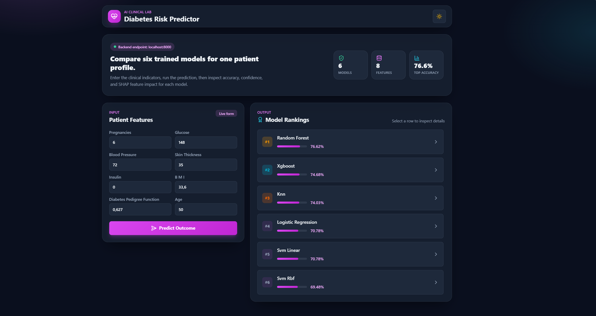
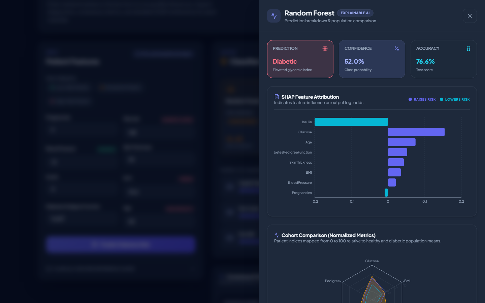
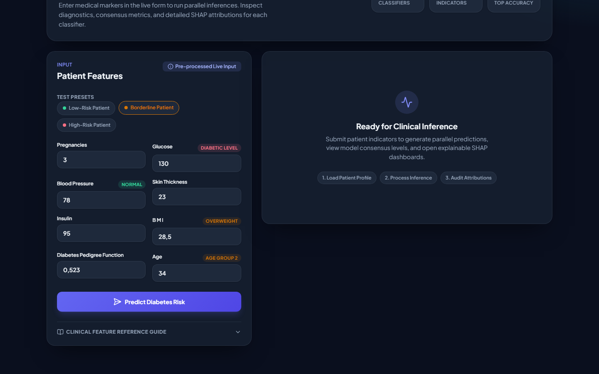
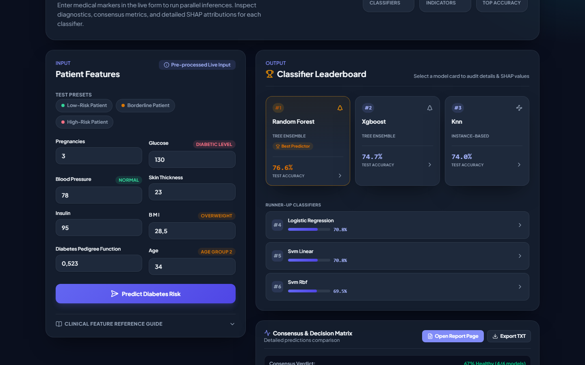

# Assignment 1: Diabetes System Report

## 1. Introduction
Diabetes is one of the most common chronic conditions worldwide, and catching it early makes a real difference in how manageable it is. This report walks through an intelligent system that was built to help with that: given a handful of routine clinical measurements, it predicts whether a female patient is likely to have diabetes. The report covers how the problem was framed, how the data was turned into something a model can learn from, which traditional machine learning models were trained and compared, and what the resulting system can (and can't) actually do.

## 2. System Definition

### System Statement
The system is best described as a diagnostic assistant. It takes a patient's clinical and demographic data, things like glucose level, BMI, and age, and predicts whether that patient has diabetes. It isn't meant to replace a doctor's judgment; rather, it's a fast, low-cost first pass that flags high-risk patients so a clinician knows where to look more closely.

### System Diagram

## 3. Problem Definition
The real-world problem the system addresses is early, low-cost detection of diabetes, so that timely medical intervention and lifestyle changes can reduce long-term health complications down the line. To do that, it receives a patient's age along with a set of clinical measurements: number of pregnancies, glucose level, blood pressure, skin thickness, insulin level, BMI, and a diabetes pedigree function score, which acts as a rough proxy for genetic risk. Internally, that information is represented as a structured feature vector of real numbers. Zero readings that are physiologically impossible, such as a Glucose or BMI of 0, are treated as missing and imputed with the training-set median, and the resulting vector is standardized so that every feature sits on comparable footing. What the model learns from this representation is the statistical relationship, essentially the decision boundary, between the input clinical features and the historic diagnosis, meaning which patterns in the data tend to show up alongside a diabetes diagnosis. The decision it produces is a binary classification, either 1 (Diabetic) or 0 (Non-Diabetic), and that prediction is meant to be used by healthcare professionals and, through a screening application, potentially by patients themselves as a preliminary signal that further testing may be warranted, not as a final word.

## 4. Dataset
The dataset used is the Kaggle Diabetes Dataset (https://www.kaggle.com/datasets/hasibur013/diabetes-dataset), which represents the physiological and demographic factors associated with diabetes onset in a population of female patients of Pima Indian heritage. One observation corresponds to a single patient's medical record at one point in time, a snapshot rather than a history, and the features recorded for each patient are Pregnancies, Glucose, BloodPressure, SkinThickness, Insulin, BMI, DiabetesPedigreeFunction, and Age. The target is `Outcome`, the diagnosis itself, which is categorical and binary, making this a classification problem rather than a regression one. In total the dataset holds 768 observations across 8 features, and all 8 of those features are numerical (some continuous, some discrete integers); none of the input features are categorical, only the target `Outcome` is.

## 5. Data Representation

| Feature | Type | Representation | Meaning |
| --- | --- | --- | --- |
| Pregnancies | Numerical | Integer | Number of times pregnant |
| Glucose | Numerical | Real value | Plasma glucose concentration a 2 hours in an oral glucose tolerance test |
| BloodPressure | Numerical | Real value | Diastolic blood pressure (mm Hg) |
| SkinThickness | Numerical | Real value | Triceps skin fold thickness (mm) |
| Insulin | Numerical | Real value | 2-Hour serum insulin (mu U/ml) |
| BMI | Numerical | Real value | Body mass index (weight in kg/(height in m)^2) |
| DiabetesPedigreeFunction | Numerical | Real value | Diabetes pedigree function (genetic risk) |
| Age | Numerical | Integer | Age in years |

There are no categorical features to encode here, but the pipeline still transforms the data twice before it reaches a model. Invalid `0` readings for things like Glucose and BMI are first replaced with the training-set median, never the test-set median, since the imputer and scaler are both `fit()` on the training split only and `transform()`-ed onto the test split, so no test-set information ever leaks into preprocessing. The whole vector is then standardized to mean 0 and variance 1. So a single feature actually passes through three distinct forms along the pipeline: the **raw feature** (possibly an invalid 0), the **imputed feature** (0 replaced by the train-only median), and the **model input** (the imputed feature standardized for distance-based models, or left unscaled for tree-based models, which don't need it).

## 6. Traditional ML Methods

### 1. Logistic Regression
Logistic Regression receives scaled numerical feature vectors and tries to learn a linear relationship between the features and the log-odds of the patient being diabetic. What it learns is a weight (coefficient) per feature, plus a bias term, guided by the criterion of maximizing the likelihood of the training data, which is equivalent to minimizing log-loss. Its main assumption is that the log-odds relationship is roughly linear and that features aren't too collinear. On the plus side, it's fast, easy to interpret, and gives calibrated probabilities rather than just hard labels; on the downside, it struggles once the true decision boundary is meaningfully non-linear.

### 2. Support Vector Machine (Linear Kernel)
This model also receives scaled numerical feature vectors, and it tries to learn the straight hyperplane that maximizes the margin of separation between diabetic and non-diabetic patients. What gets learned are the hyperplane weights and the support vectors, the handful of data points closest to the boundary that actually determine it. Its learning criterion is maximizing margin while penalizing points on the wrong side (hinge loss), tuned via the regularization parameter C, and it assumes the classes are close to linearly separable. Its strengths are robustness to outliers when properly regularized and effectiveness in high-dimensional spaces; its weakness is that it scales poorly to very large datasets and can't capture curved decision boundaries.

### 3. Support Vector Machine (RBF Kernel)
Like the linear SVM, this model receives scaled numerical feature vectors, but it tries to learn a non-linear boundary by projecting the data into a higher-dimensional space via a Radial Basis Function. What it learns are the support vectors, their weights, and a gamma parameter that controls how far each support vector's influence reaches, with the same margin-maximization criterion applied in the transformed space this time. It assumes that points close together in the transformed space belong to the same class. It's considerably more capable of modeling complex, non-linear relationships than its linear cousin, but it's also less interpretable, heavier to train, and genuinely sensitive to hyperparameter choices.

### 4. K-Nearest Neighbors (KNN)
KNN also works on scaled numerical feature vectors, but unlike the models above it doesn't learn a global relationship at all; instead it assumes similar inputs have similar outputs based on spatial distance. No parameters are learned up front, since KNN is a "lazy learner" that simply memorizes the training data, and its guiding criterion is proximity (Euclidean distance): a new patient's class comes from a majority vote of its *k* closest neighbors. It assumes that nearby points in feature space share the same label and that every feature contributes equally to that distance, which is exactly why scaling isn't optional here. It's simple, handles non-linear boundaries naturally, and needs no real training phase, but it's slow at prediction time on large datasets and sensitive to irrelevant features and the curse of dimensionality.

### 5. Random Forest
Random Forest receives unscaled numerical feature vectors, since trees don't care about feature magnitude, and it tries to learn a complex, non-linear decision structure by combining many independent decision trees. What gets learned is an ensemble of trees, each with its own hierarchy of threshold-based splitting rules, guided by the criterion of minimizing impurity (Gini or entropy) at each split for each individual tree. It makes very few assumptions about the data distribution, mainly that averaging many independently-trained, imperfect trees reduces variance. Its strengths are strong accuracy, robustness to outliers, and picking up non-linear interactions with no feature engineering; its weaknesses are that individual trees can overfit if left too deep, and the ensemble as a whole is a black box that's hard to interpret directly.

### 6. XGBoost (Extreme Gradient Boosting)
XGBoost also receives unscaled numerical feature vectors, and it learns a non-linear decision boundary by sequentially combining trees, where each new one targets the errors left by the ones before it. What it learns is a sequence of trees with split points and leaf weights tuned via gradient descent, guided by the criterion of minimizing a differentiable loss function (log-loss) over the ensemble. It assumes that the residual errors from earlier trees are themselves learnable patterns that later trees can correct. It's often near state-of-the-art on tabular data, handles missing values natively, and is highly optimized, but it's easy to overfit without careful tuning, harder to interpret than a single tree, and more expensive to tune well than Random Forest.

## 7. Experimental Design

### Experiment 1: Model Comparison
The question this experiment asks is which of the traditional machine learning models performs best at classifying diabetes when all six are trained and evaluated under identical conditions. To answer it, Logistic Regression, SVM (Linear), SVM (RBF), KNN, Random Forest, and XGBoost are all trained on the same 80/20 train-test split, with scaled data going to the distance-based models (LR, SVM, KNN) and unscaled data to the tree models (Random Forest, XGBoost). Each is evaluated with Accuracy, Precision, Recall, and F1-score.

### Experiment 2: Hyperparameter Investigation
This experiment asks how the number of neighbors (*k*) and the weighting scheme (`uniform` vs. `distance`) affect KNN's performance on this dataset. A 5-fold `GridSearchCV` sweeps *k* in {3, 5, 7, 9} crossed with weights in {uniform, distance}, and rather than only reporting the single best combination, the **full** `cv_results_` grid is inspected to see how cross-validated accuracy actually moves across it. The best configuration turned out to be *k*=9 with `weights='uniform'`, reaching a CV accuracy of 0.7607. Accuracy spread 0.0342 across all 8 combinations tested, enough to say *k* is a genuinely meaningful hyperparameter here rather than something safe to leave at a default. The trend climbs from *k*=3 up to *k*=9 in this range, which lines up with the usual story: small *k* overfits to a few noisy neighbors (high variance), while a larger *k* smooths the decision boundary, trading some bias for lower variance, which suits this dataset's amount of class overlap.

### Experiment 3: Representation / Feature Investigation
The question here is whether standardizing (scaling) the feature vectors actually improves performance for a distance-based model like KNN. A KNN classifier (*k*=5) is trained twice, once on the raw, unscaled feature vectors, and once on the standardized ones, and the two test accuracies are compared directly. Unscaled accuracy came out to **67.53%**, scaled accuracy to **75.32%**, a **+7.8 point** jump from standardization alone. That matches expectations: raw features have wildly different ranges (Pedigree Function stays below 1, while Insulin can exceed 100), so unscaled Euclidean distance is effectively dominated by whichever feature happens to have the largest range. Standardizing forces every feature to contribute proportionally, which is exactly why the representation choice discussed in Section 5 isn't a cosmetic detail; it's a real determinant of model quality.

## 8. Results

*Reproduced end-to-end by executing [Report_Notebook.ipynb](Report_Notebook.ipynb) (Aug 2026 run, after fixing the train/test leakage in the median-imputation step, see Section 5).*

| Model | Accuracy | Precision | Recall | F1 |
| --- | --- | --- | --- | --- |
| Baseline (Most Frequent) | 64.94% | 0.000 | 0.000 | 0.000 |
| Logistic Regression | 70.78% | 0.600 | 0.500 | 0.545 |
| SVM (Linear) | 70.78% | 0.605 | 0.481 | 0.536 |
| SVM (RBF) | 69.48% | 0.581 | 0.463 | 0.515 |
| KNN (Best k=9, uniform) | 74.03% | 0.635 | 0.611 | 0.623 |
| **Random Forest** | **76.62%** | **0.696** | 0.593 | **0.640** |
| XGBoost | 74.68% | 0.653 | 0.593 | 0.621 |

The baseline's Precision, Recall, and F1 all land at **0.000** because `DummyClassifier(strategy='most_frequent')` always predicts "Non-Diabetic," so it never identifies a single diabetic patient, yet it still racks up 64.94% accuracy simply because that's the non-diabetic proportion of the dataset. This is precisely why a baseline matters here: accuracy alone would make this useless strategy look "pretty good," while Precision, Recall, and F1 correctly reveal it has zero diagnostic value.

For a medical screening tool like this, **Recall** arguably matters most, since high recall keeps False Negatives down, meaning it minimizes the number of diabetic patients who get told they're healthy. Accuracy still gives a useful overall picture, but **F1-score** (the harmonic mean of precision and recall) is what's used to rank models and automatically pick the final one, since it's far more informative than raw accuracy on a dataset that's roughly 65% non-diabetic and 35% diabetic.

## 9. Model Comparison
Random Forest came out on top across the board, with 76.62% accuracy, 0.696 precision, and the best F1-score at 0.640, so it was selected as the final model. As an ensemble method, it naturally picked up on non-linear relationships and interactions between features like Glucose, BMI, and Age in a way the linear models (Logistic Regression and Linear SVM) couldn't quite match. KNN (k=9) and XGBoost trailed closely behind (F1 = 0.623 and 0.621), which suggests both instance-based and boosted-tree approaches are genuinely competitive on this kind of tabular data once the features are properly represented, imputed and scaled correctly. SVM (RBF) was the weakest of the trained models (F1 = 0.515), barely edging out the baseline; its non-linear kernel simply didn't uncover structure beyond what the simpler linear models already captured here.

## 10. Representation Analysis
The feature-vector representation used here is appropriate because the medical data itself already arrives as independent tabular measurements, so a fixed-length feature vector captures each patient's discrete clinical readings without forcing anything into an unnatural shape. What it preserves is the exact magnitude and statistical distribution of the clinical tests, but what it loses is time: a single feature vector is a snapshot, so it can't show whether a patient's BMI or glucose has been climbing or falling over the past several years. The same problem probably couldn't be represented well as an image, unless the dataset included something inherently visual, like retinal scans for diabetic retinopathy or ultrasound imagery of organs, in which case an image representation would make sense. It could be represented as a sequence if multiple visits per patient were available, which would open the door to RNNs or LSTMs that model a patient's trajectory over time, and it could similarly be represented as a graph if genetic family trees or social and environmental proximity data were included, to see whether diabetes clusters within families or communities. Learned embeddings would only really be useful if the input were something unstructured, like raw clinical notes in text form; for the numerical features used here, embeddings would be overkill. If the representation changed, the model family would have to change too, CNNs for images, RNNs for sequences, GNNs for graphs, generally at the cost of both more computation and less interpretability than the straightforward feature-vector approach used here.

## 11. Intelligent Application
The trained models are wired into a full-stack application (`app/` directory: FastAPI backend + React frontend, with SHAP-based per-feature explanations). What started as a single predict-and-explain screen grew into a small multi-page dashboard, organized around five views.

The main **Predictor** view lets a user enter a patient's clinical data once, or load one of three built-in presets (Low-Risk, Borderline, High-Risk) for quick testing, and the backend `/api/predict` endpoint runs that same patient through all six trained models at once, returning a ranked comparison instead of a single black-box answer. Three key inputs (Glucose, BMI, Blood Pressure) show a live clinical range badge (Normal, Watch, High) as the user types, for context before a prediction is even run. Below the ranking, a Consensus and Decision Matrix aggregates the six individual verdicts into one summary (for example "5/6 models predict Diabetic") alongside a full table of every model's prediction, confidence, and test accuracy, plus a one-click Export to a plain-text report. Selecting any row in that table opens a **model detail drawer** with that model's prediction, confidence, a SHAP feature-attribution chart, and a Cohort Comparison radar chart that plots the current patient against the dataset's healthy and diabetic population averages across six key features. A **History** page keeps a session-local audit trail (persisted in `localStorage`) of every prediction run, so a profile can be reloaded or its report reopened later, and a **Clinical Report** page turns a given prediction into a formatted, printable summary (patient data, all six model outputs, top SHAP drivers, a disclaimer), the same content the Export button saves as text. Finally, an **Insights and Models** page reproduces the dataset's own exploratory analysis (correlation matrix, feature averages by outcome, age distribution, a Glucose-vs-BMI scatter) along with the model-comparison and model-understanding content from Sections 6 through 9 of this report, live in the app rather than only living in the static notebook.

*(Screenshots above may lag slightly behind the very latest styling pass; retake if the drawer still shows a "Clinical Narrative" / "Mathematical Specs" tab or red/green charts, both of which were since removed or recolored.)*

To verify the complete input-to-prediction path end to end, three patient profiles covering a range of risk levels were entered directly into the application. The low-risk profile is a young patient (22) with a normal glucose reading (85 mg/dL), a healthy BMI (26.6), 1 prior pregnancy, and a low pedigree score (0.351). The borderline profile is a mid-30s patient (34) with mildly elevated glucose (130 mg/dL), a BMI in the overweight range (31.2), 3 prior pregnancies, and a moderate pedigree score (0.523), the kind of profile where a screening tool is most useful since it isn't obviously healthy or obviously high-risk. The high-risk profile is an older patient (51) with clearly elevated glucose (183 mg/dL), an obese BMI (39.5), 8 prior pregnancies, and a high pedigree score (1.288) indicating a strong family history.

The predicted diabetes probability should rise in step with these accumulating risk factors, a useful sanity check that the pipeline behaves the way the clinical reasoning behind it would predict.

## 12. Limitations
The dataset is limited to females of Pima Indian heritage, so the model is unlikely to generalize well to male patients or to populations with different genetic backgrounds and dietary patterns. Because it's a point-in-time assessment, the model also has no way to factor in a patient's trajectory, such as recent rapid weight loss or a sudden change in glucose control. And since the model doesn't achieve 100% recall, it will still miss some diabetic patients, which is a real and significant risk in a healthcare context.

## 13. Reflection
The system receives eight numerical clinical and demographic measurements per patient: Pregnancies, Glucose, BloodPressure, SkinThickness, Insulin, BMI, DiabetesPedigreeFunction, and Age. Nothing about a patient's history, symptoms, or context beyond those eight numbers ever reaches the model. Internally, those eight raw readings get cleaned (impossible zeros imputed with a training-only median) and standardized into a single scaled, 8-dimensional feature vector, which is the entire "world" the model ever sees; there is no notion of the patient as a person, only as a point in an 8-dimensional space. By comparing thousands of these feature vectors against their known outcomes, the model learns statistical boundaries, hyperplanes for the linear models, distance neighborhoods for KNN, sequences of threshold splits for the tree ensembles, that separate diabetic from non-diabetic profiles. It is, in effect, learning a compressed summary of what combinations of glucose, BMI, age, and the rest tend to co-occur with a diabetes diagnosis in this population, not a causal or biological explanation of why. The prediction it makes is a discrete binary decision, 0 (non-diabetic) or 1 (diabetic), optionally alongside a probability score that expresses how confident the model is. It can handle an unseen input because it never memorized specific patient rows; it generalized a rule, like "high BMI combined with high glucose tends to raise risk," that extends naturally to new combinations of the same eight features, even ones no training patient exhibited exactly.

The part of the system that can reasonably be called "intelligent" is mainly the training phase: the process by which an algorithm autonomously adjusts its internal parameters, weights, splits, support vectors, to reduce error on the examples it's given, without a human hand-writing the diagnostic rules. Choosing which models to try, tuning their hyperparameters, and deciding which metric should govern final-model selection also involved a kind of designed intelligence, but that part is human, not the model's. What still prevents it from being a more capable intelligent system is that it has no contextual awareness: it can't ask a follow-up question the way a doctor would, it knows nothing about a patient's actual family history beyond a single pedigree-function number, it can't factor in symptoms, medications, or recent trends, and on its own it can't explain its reasoning in a way a clinician would find intuitive, which is why a separate tool like SHAP had to be bolted on to get any explanation at all. Fundamentally, it is pattern recognition over a fixed set of numbers, not anything resembling clinical reasoning, which is exactly why it's positioned as a screening aid rather than a diagnostic authority.

## 14. Conclusion
This project built an intelligent system for predicting diabetes from routine clinical measurements, covering raw data, representation, six trained models, and a working application. A train/test leakage issue in the imputation step was caught and fixed, and full Precision/Recall/F1 reporting replaced plain accuracy. Random Forest came out ahead on held-out data (76.62% accuracy, 0.640 F1) and was selected as the final model.

The three experiments reinforced a few points: every model beats the zero-F1 baseline, KNN's accuracy is genuinely sensitive to the choice of *k*, and standardizing features lifts its accuracy by 7.8 points, a reminder that representation matters as much as model choice. The system is a useful preliminary screening tool, verified end-to-end with three sample patients, but it carries real limitations: a narrow training demographic (Pima Indian females), no sense of time, and only 768 records to learn from.
