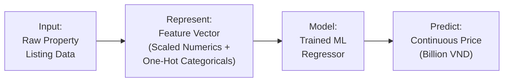

# Assignment 2: Vietnam Real Estate Price Prediction Report

## 1. Introduction
This report documents the design, implementation, and evaluation of an intelligent system for predicting the market price of residential properties in Vietnam based on their listing attributes. The system uses several traditional Machine Learning regression models to translate raw property listing data (area, location, layout, legal status, furnishing) into a continuous price estimate, serving as a preliminary valuation aid for buyers, sellers, and real-estate agents.

## 2. System Definition
### System Statement
The intelligent system is a price-estimation assistant that takes a raw property listing — physical measurements (area, frontage, road access), layout (floors, bedrooms, bathrooms), location (address/district), and qualitative attributes (direction, legal status, furniture state) — and converts it into a numerical feature vector. A trained regression model then maps this vector to a predicted price in billions of VND, giving users a fast, data-driven reference point before negotiating a real transaction.

### System Diagram

## 3. Problem Definition
- **What real-world problem does the system address?** It addresses the difficulty of estimating a fair market price for a property listing without manually comparing dozens of similar listings, helping buyers avoid overpaying and sellers/agents price competitively.
- **What information does the system receive?** Property attributes: `Area`, `Frontage`, `Access Road` width, `Floors`, `Bedrooms`, `Bathrooms`, `House direction`, `Balcony direction`, `Legal status`, `Furniture state`, and a free-text `Address` (from which `District` is extracted).
- **How is that information represented internally?** As a standardized, one-hot encoded numerical feature vector (367 dimensions after encoding); the target `Price` is modeled in log space (`log1p(Price)`) to counteract its strong right skew, then converted back to VND for evaluation.
- **What does the model learn?** The statistical relationship between property/location attributes and (log) price, learned from ~30,000 historical listings.
- **What decision or prediction does it produce?** A continuous price prediction (billions of VND), not a category.
- **Who or what uses the prediction?** Property buyers, sellers, and real-estate agents/brokers, via the deployed web application (`app/`), as a quick reference point during price negotiation.

## 4. Dataset
- **Dataset Source:** `vietnam_housing_dataset.csv` — a collection of Vietnamese residential real-estate listings. **[TODO: paste the exact Kaggle/source URL here — not recorded in the project files, must be filled in by the author.]**
- **What real-world phenomenon is represented?** The pricing behavior of the Vietnamese residential real-estate market, driven by property size, location, and quality attributes.
- **What is one observation?** A single property listing (one row = one house/apartment posted for sale).
- **What are the features?** Address, Area, Frontage, Access Road, House direction, Balcony direction, Floors, Bedrooms, Bathrooms, Legal status, Furniture state (11 raw columns).
- **What is the target?** `Price` (in billions of VND).
- **Is the target numerical or categorical?** Numerical (continuous).
- **Is this regression or classification?** Regression.
- **How many observations are available?** 30,229 listings (after dropping rows with missing `Price`).
- **How many features are available?** 11 raw columns; after one-hot encoding categorical fields (including the 342 unique districts extracted from `Address`), the model input has 367 dimensions.
- **Which features are numerical?** Area, Frontage, Access Road, Floors, Bedrooms, Bathrooms.
- **Which features are categorical?** District (engineered from Address), House direction, Balcony direction, Legal status, Furniture state.

## 5. Data Representation

| Feature | Type | Representation | Meaning |
| --- | --- | --- | --- |
| Area | Numerical | Real value | Property floor area (m²) |
| Frontage | Numerical | Real value | Width of the property facing the street (m) |
| Access Road | Numerical | Real value | Width of the road giving access to the property (m) |
| Floors | Numerical | Integer | Number of floors |
| Bedrooms | Numerical | Integer | Number of bedrooms |
| Bathrooms | Numerical | Integer | Number of bathrooms |
| District (from Address) | Categorical | One-hot encoded (342 categories) | District/administrative area extracted from the raw address string |
| House direction | Categorical | One-hot encoded | Compass direction the house faces (e.g. Đông - Bắc) |
| Balcony direction | Categorical | One-hot encoded | Compass direction the balcony faces |
| Legal status | Categorical | One-hot encoded | Legal ownership status (e.g. Have certificate, Sale contract) |
| Furniture state | Categorical | One-hot encoded | Furnishing level (e.g. Full, Basic) |

*(Note: Missing numerical values are imputed with the column median; missing categorical values are filled with `'Unknown'` before encoding — missingness is substantial for several columns, e.g. Balcony direction 82.6%, House direction 70.3%, Furniture state 46.7%. Categorical columns are converted with `pd.get_dummies(drop_first=True)`. The target `Price` is transformed with `log1p` before training and inverted with `expm1` before computing evaluation metrics, and all 367 input dimensions are standardized with `StandardScaler` fit on the training set only.)*

## 6. Traditional ML Methods

### 1. Linear Regression
- **What representation does it receive?** Scaled, one-hot encoded feature vectors; target in log-price space.
- **What relationship does it try to learn?** A linear relationship between the feature vector and log(Price).
- **What parameters or structures are learned?** A weight (coefficient) per feature dimension and a bias term.
- **What criterion guides learning?** Minimizing mean squared error between predicted and actual log-price.
- **What assumptions does the model make?** Linearity between features and the (log) target, limited multicollinearity, and roughly homoscedastic residuals.
- **What are its strengths?** Fast to train, highly interpretable coefficients, a solid reference point for more complex models.
- **What are its weaknesses?** Cannot capture non-linear price effects (e.g. diminishing returns on area) or feature interactions (e.g. district × legal status).

### 2. Support Vector Regressor (RBF Kernel)
- **What representation does it receive?** Scaled feature vectors, log-price target.
- **What relationship does it try to learn?** A non-linear function that keeps most training points within an ε-margin of the predicted surface, using an RBF kernel to implicitly project data into a higher-dimensional space.
- **What parameters or structures are learned?** Support vectors, their weights, and the kernel influence (`gamma`).
- **What criterion guides learning?** Minimizing model complexity while tolerating small errors within ε (ε-insensitive loss), controlled by `C` and `gamma`.
- **What assumptions does the model make?** Nearby points in the transformed feature space should have similar prices.
- **What are its strengths?** Captures non-linear relationships without manual feature engineering; robust to moderate outliers.
- **What are its weaknesses?** Expensive to train/tune on large datasets (30k rows); hyperparameters (`C`, `gamma`) need careful search; hard to interpret.

### 3. Support Vector Regressor (Linear Kernel)
- **What representation does it receive?** Scaled feature vectors, log-price target.
- **What relationship does it try to learn?** A linear price surface that keeps most points within an ε-margin, similar to Linear Regression but with margin-based (hinge-like) loss instead of squared error.
- **What parameters or structures are learned?** A weight vector and bias defining the linear regression hyperplane.
- **What criterion guides learning?** ε-insensitive squared loss, regularized by `C`.
- **What assumptions does the model make?** The price surface is approximately linear in the encoded feature space.
- **What are its strengths?** More robust to outliers than ordinary least squares; scales better than the RBF kernel to many samples (`dual=False` formulation).
- **What are its weaknesses?** Same linearity limitation as Linear Regression; cannot model non-linear or interaction effects.

### 4. K-Nearest Neighbors Regressor
- **What representation does it receive?** Scaled feature vectors (mandatory, since KNN relies on distance).
- **What relationship does it try to learn?** No explicit function is learned; prediction is the (possibly distance-weighted) average price of the `k` most similar listings.
- **What parameters or structures are learned?** None — KNN is a lazy learner that memorizes the training set.
- **What criterion guides learning?** Proximity in the standardized 367-dimensional feature space (Euclidean distance).
- **What assumptions does the model make?** Similar listings (in feature space) have similar prices; all dimensions contribute meaningfully to distance.
- **What are its strengths?** Simple, captures local non-linear structure, no training phase.
- **What are its weaknesses?** Slow prediction on large datasets; degrades in high-dimensional sparse spaces (367 dims, mostly one-hot binary columns) — the "curse of dimensionality."

### 5. Random Forest Regressor
- **What representation does it receive?** Unscaled, one-hot encoded feature vectors (trees do not require scaling).
- **What relationship does it try to learn?** A non-linear, hierarchical partition of the feature space built by averaging predictions from many independent decision trees.
- **What parameters or structures are learned?** An ensemble of trees, each with feature-threshold splitting rules.
- **What criterion guides learning?** Minimizing variance (squared error) at each split, averaged across bootstrap-sampled trees.
- **What assumptions does the model make?** Few distributional assumptions; assumes averaging many decorrelated trees reduces variance.
- **What are its strengths?** Naturally captures non-linearities and feature interactions (e.g. area × district); robust to outliers and irrelevant one-hot columns.
- **What are its weaknesses?** Larger memory/compute footprint; less interpretable than a single tree or linear model.

### 6. XGBoost Regressor
- **What representation does it receive?** Unscaled, one-hot encoded feature vectors.
- **What relationship does it try to learn?** A non-linear price function built by sequentially adding trees that correct the residual errors of the previous ensemble.
- **What parameters or structures are learned?** A sequence of boosted trees with optimized split points and leaf weights.
- **What criterion guides learning?** Minimizing a regularized squared-error objective via gradient boosting.
- **What assumptions does the model make?** Residual errors from earlier trees contain learnable signal that later trees can correct.
- **What are its strengths?** State-of-the-art accuracy on tabular data; handles the high-dimensional sparse one-hot district encoding well; built-in regularization reduces overfitting.
- **What are its weaknesses?** More hyperparameters to tune (`learning_rate`, `max_depth`, `n_estimators`); can overfit if not tuned; least interpretable of the six models.

## 7. Experimental Design

### Experiment 1: Model Comparison
- **Question:** Which of the six regression models best predicts property price under identical train/test conditions?
- **Setup:** All six models are trained on the same 80/20 split (`random_state=42`) of the same standardized, one-hot encoded feature matrix, with `log1p(Price)` as the target; predictions are inverse-transformed with `expm1` before scoring on the held-out test set.

### Experiment 2: Hyperparameter Investigation
- **Question:** How do the number of neighbors (`n_neighbors`) and the weighting scheme (`uniform` vs. `distance`) affect KNN regression accuracy on this dataset?
- **Setup:** `GridSearchCV` (3-fold) is run over `n_neighbors` ∈ {3, 5, 7, 9} × `weights` ∈ {uniform, distance} on the scaled training data, scoring by negative MSE in log-price space.
- **Result:**

| n_neighbors | weights | CV RMSE (log space) |
| --- | --- | --- |
| 3 | distance | 0.2807 |
| 3 | uniform | 0.2820 |
| 5 | distance | 0.2720 |
| 5 | uniform | 0.2751 |
| 7 | distance | 0.2688 |
| 7 | uniform | 0.2737 |
| **9** | **distance** | **0.2684 (best)** |
| 9 | uniform | 0.2751 |

Error decreases monotonically as `k` grows from 3 to 9 (higher `k` reduces variance/overfitting to noisy individual neighbors), and `distance` weighting consistently beats `uniform` weighting at every `k` (closer, more relevant neighbors are given more influence). The best configuration found was `n_neighbors=9, weights='distance'`.

### Experiment 3: Representation / Feature Investigation
- **Question:** Does modeling `log1p(Price)` instead of raw `Price` improve Linear Regression performance, given the strong right skew of the target observed during EDA?
- **Setup:** Linear Regression is trained twice on the same 80/20 split and the same standardized features — once directly on raw `Price`, once on `log1p(Price)` with predictions inverted via `expm1` — and compared on the same test set.
- **Result:**

| Target | MAE | RMSE | R² |
| --- | --- | --- | --- |
| Raw `Price` | **1.2747** | **1.6391** | **0.4490** |
| `log1p(Price)` | 1.3001 | 1.7478 | 0.3735 |

**Contrary to the initial expectation**, modeling the raw price directly gave *better* test-set MAE/RMSE/R² than modeling the log-transformed price for Linear Regression. This happens because `expm1()` back-transformation of a linear model's log-space prediction is a non-linear operation: minimizing squared error in log space does not minimize squared error in the original VND space (Jensen's-inequality-style bias), so the inverse transform reintroduces error even though the log target is better behaved (more Gaussian) *during training*. This is an important, non-obvious representation finding: transforming a skewed target can improve the training objective's statistical assumptions while *not* improving the metric that is ultimately reported, if the model class is simple (linear) and the transform is undone naively. (Note: the tree ensembles, XGBoost and Random Forest, are far less sensitive to this effect since they are not linear in the target space and generally tolerate skew well — this is one reason they outperform Linear Regression overall.)

## 8. Results

| Model | MAE | MSE | RMSE | R² |
| --- | --- | --- | --- | --- |
| Baseline (predict mean) | 1.8696 | 5.0270 | 2.2421 | -0.0310 |
| Linear Regression | 1.3001 | 3.0548 | 1.7478 | 0.3735 |
| SVR (Linear) | 1.3147 | 3.0398 | 1.7435 | 0.3765 |
| KNN (k=9, distance) | 1.2751 | 2.8740 | 1.6953 | 0.4106 |
| SVR (RBF) | 1.1195 | 2.3165 | 1.5220 | 0.5249 |
| Random Forest | 1.0696 | 2.1345 | 1.4610 | 0.5623 |
| **XGBoost** | **1.0498** | **1.9726** | **1.4045** | **0.5954** |

*(All values are in billions of VND, computed after inverse log-transforming predictions back to price space. All six trained models clearly beat the mean-prediction baseline, whose slightly negative R² illustrates that a naive constant guess is worse than always predicting the sample mean directly in price space — an artifact of comparing a log-space baseline against a linear price-space benchmark.)*

**Appropriate Metrics:** For a price-estimation tool, **R²** is useful to summarize how much of the price variance the model explains overall, but **MAE** and **RMSE** (both in billions of VND) are more actionable for an end user, since they express a typical prediction error in real currency terms rather than an abstract variance-explained percentage. RMSE additionally penalizes large errors more than MAE, which matters here because the target has high-value outliers.

## 9. Model Comparison
XGBoost achieved the best overall performance (R² = 0.5954, MAE = 1.05B VND), narrowly ahead of Random Forest (R² = 0.5623). Both tree-based ensembles clearly outperformed every non-tree model, confirming that price depends on non-linear interactions between features (e.g., a large area only commands a premium in the right district, with the right legal status) that linear and margin-based models cannot capture directly. SVR (RBF) was the best non-tree model (R² = 0.5249), showing that a non-linear kernel recovers some of this structure. KNN, SVR (Linear), and plain Linear Regression performed closely to each other and noticeably worse, consistent with Experiment 2's finding that KNN struggles in the 367-dimensional, mostly-sparse one-hot feature space, and with the linear models' inability to model feature interactions.

## 10. Representation Analysis
- **Why is your feature-vector representation appropriate?** Each listing naturally comes as a fixed set of independent attributes (area, rooms, direction, legal status, district), which maps cleanly onto a fixed-length feature vector — the standard representation for tabular data.
- **What information does it preserve?** It preserves the exact magnitude of physical measurements (area, frontage, road width) and the categorical identity of location/quality attributes (district, legal status, furniture state, direction).
- **What information might it lose?** It loses free-text nuance in the original `Address` (only a coarse `District` is kept), any visual information (property photos), listing age or market-trend context, and precise geographic coordinates (only a district-level category, not latitude/longitude or proximity to amenities).
- **Could the same problem be represented as an image?** Partially — property photos could feed a CNN to estimate condition/quality, but core drivers like legal status or exact area would still need to come from structured/text data.
- **Could it be represented as a sequence?** Yes, if the same property or district had multiple price observations over time, a sequence/time-series representation (RNN/LSTM or a simple trend feature) could model market appreciation.
- **Could it be represented as a graph?** Yes — properties could be nodes connected by geographic proximity or shared district/amenities, letting a graph neural network propagate price signal between comparable nearby listings (a more principled alternative to the current 342-category one-hot district encoding).
- **Could it be represented using learned embeddings?** Yes — instead of one-hot encoding 342 districts (very sparse, hard for KNN and linear models), a learned embedding (or even geocoded latitude/longitude) would give a much lower-dimensional, more informative location representation.
- **What would change if the representation changed?** Using embeddings or graph structure would reduce dimensionality (mitigating the curse-of-dimensionality issue seen with KNN), likely improve distance/margin-based models, and could enable transfer to districts with few listings — at the cost of needing additional geocoding infrastructure and losing some interpretability.

## 11. Intelligent Application
The trained `xgboost.pkl` model (the best performer from Experiment 1) is integrated into a full-stack application (`app/` directory: FastAPI backend + frontend). Users enter property details (area, district, legal status, etc.) into the UI and receive an instant predicted price from the backend API.
*[Insert screenshot of Application UI here]*
*[Insert screenshot of a Prediction Result here — recommended: at least 3 different input cases, as required for System Demonstration]*

## 12. Limitations
- **Heavy Missingness:** Several fields are missing for a large share of listings — Balcony direction (82.6%), House direction (70.3%), Furniture state (46.7%), Access Road (44.0%), Frontage (38.3%). Median/`'Unknown'` imputation is a simple strategy that may understate uncertainty for heavily-imputed listings.
- **High-Cardinality Location Encoding:** One-hot encoding 342 districts adds 341 sparse binary columns, which hurts distance-based models (KNN) and increases the risk of overfitting on rare districts.
- **Target Transform Bias:** As shown in Experiment 3, naively modeling `log1p(Price)` and inverting with `expm1` can *increase* real-currency error for simple (linear) models — the transform must be chosen per model, not applied blindly.
- **No Precise Geolocation:** The dataset provides only a text address (reduced to district), not latitude/longitude, so the model cannot learn fine-grained proximity effects (e.g., distance to a specific school or highway).
- **Bounded Price Range:** Observed prices range from 1.0 to 11.5 billion VND; the model is unlikely to generalize well to ultra-luxury properties or micro-transactions outside this range.

## 13. Reflection
- **What information does your system receive?** Raw property listing attributes: physical measurements, layout, direction, legal status, furnishing, and a free-text address.
- **What is the internal representation?** A standardized, 367-dimensional feature vector (numerical values scaled, categorical values one-hot encoded), with the target modeled in log-price space during training.
- **What does the model learn from examples?** Statistical relationships between property/location attributes and price, learned from ~30,000 historical listings — including non-linear interactions captured by the tree-based models.
- **What prediction or decision does it make?** A continuous price estimate in billions of VND for a new, unseen listing.
- **Why can it handle an unseen input?** Because it learned generalizable patterns (e.g., "larger area + central district + full legal certificate → higher price") rather than memorizing specific training rows — evidenced by KNN and the ensemble models generalizing reasonably to the held-out 20% test set.
- **What part of the system can reasonably be called "intelligent"?** The training phase, where each model autonomously adjusts its internal parameters (regression weights, tree splits and leaf values) to minimize prediction error on historical data, without hand-coded pricing rules.
- **What limitations prevent it from being a more capable intelligent system?** It cannot see the property (no image understanding), has no true geospatial reasoning (only a coarse district category), cannot account for market timing/trends, and cannot explain its reasoning in natural language to a user.

## 14. Conclusion
We designed and implemented an intelligent system for predicting Vietnamese residential property prices from listing attributes. Across six traditional ML models, XGBoost achieved the best performance (R² = 0.5954, MAE ≈ 1.05 billion VND), with Random Forest close behind, confirming that tree-based ensembles are best suited to this tabular, high-cardinality, interaction-heavy pricing problem. The controlled experiments revealed two non-obvious findings: KNN performance improves monotonically with `k` up to 9 with distance weighting, and — counter to the usual "always transform skewed targets" intuition — naively log-transforming the target actually *hurt* Linear Regression's real-currency error due to back-transformation bias. While the deployed application provides real, actionable price estimates, its value is bounded by substantial missing data, a coarse district-only location representation, and a limited observed price range, which should guide future improvements (e.g., geocoded coordinates, learned location embeddings, listing photos).
