**HỌC VIỆN CÔNG NGHỆ BƯU CHÍNH VIỄN THÔNG**

**KHOA CÔNG NGHỆ THÔNG TIN**

**PHÁT TRIỂN HỆ THỐNG THÔNG MINH (INTELLIGENT SYSTEM DEVELOPMENT)**

**BÀI TẬP LỚN 02**

Từ Biểu diễn Dữ liệu đến Hệ thống Thông minh Triển khai được

> Họ và tên  : Nguyễn Văn Trường
>
> Mã sinh viên : B23DCCE095
>
> Lớp        : E23CNPM02
>
> Giảng viên : Dinh Que Tran, Ph.D., Assoc. Prof.
>
> Học kỳ     : I.2026

*Phần thân báo cáo (Mục 1-11) là báo cáo ~10 trang. Ảnh chụp màn hình web và mobile cùng các
bảng thông số kỹ thuật theo từng ứng dụng nằm ở Phụ lục D và E - các phụ lục không tính vào
số trang theo quy định của đề bài. Mọi con số đều là giá trị đã chạy thực tế từ notebook
tương ứng (`notebook/*.ipynb`; Python 3.13, Windows 11, scikit-learn 1.9.0, `RANDOM_SEED = 42`).*

## 1. Giới thiệu và Mục tiêu (Tóm tắt)

Báo cáo xây dựng ba hệ thống thông minh triển khai được từ dữ liệu Kaggle thô - một **bộ
phân loại sàng lọc tiểu đường**, một **mô hình hồi quy giá nhà**, và một **bộ phân loại
gợi ý sản phẩm cho thương mại điện tử có sử dụng cả văn bản đánh giá** - và đưa mỗi hệ thống
đi hết pipeline, kết thúc bằng một dịch vụ FastAPI `POST /predict` được gọi bởi một trang web
React/Vite và một ứng dụng Flutter. Mục tiêu là minh họa ba loại dữ liệu thực tế khác nhau
trở thành biểu diễn số học mà mô hình học máy có thể xử lý như thế nào.

| Ứng dụng | Bài toán | Mô hình được chọn | Kết quả chính (test) |
|---|---|---|---|
| Tiểu đường | Phân loại nhị phân (có / không tiểu đường) | Random Forest | ROC-AUC 0.809, recall lớp tiểu đường 0.735, accuracy 0.725 |
| Giá nhà | Hồi quy (giá bán, triệu VND) | Random Forest trên `log1p(Price)` | MAE 10 626, RMSE 26 873, R^2 0.186 |
| Hành vi khách hàng | Phân loại nhị phân (khách có gợi ý sản phẩm không) | Logistic Regression trên tabular + văn bản TF-IDF | ROC-AUC 0.964, macro-F1 0.858, recall lớp "không gợi ý" 0.876 |

| Ứng dụng | Bộ dữ liệu (Kaggle) | Số dòng (thô -> sạch) | Biểu diễn | Triển khai |
|---|---|---|---|---|
| Tiểu đường | `alexteboul/diabetes-health-indicators-dataset` (BRFSS 2015) | 253 680 -> 229 781 | `X in R^{N x 23}` scaled + passthrough | FastAPI + React/Vite + Flutter |
| Giá nhà | `qmanhbeo/vietnamese-real-estate-listings-may-2024` (CC BY-NC 4.0) | 236 226 -> 201 654 | `X in R^{N x 92}` impute + scale + one-hot (thưa) | FastAPI + React/Vite + Flutter |
| Hành vi khách hàng | `nadyinky/sephora-products-and-skincare-reviews` (CC0) | 116 262 -> 104 313 | `X in R^{N x 28 733}` tabular + văn bản TF-IDF (thưa) | FastAPI + React/Vite + Flutter |

## 2. Liên hệ với Bài giảng 02 - Biểu diễn Dữ liệu

```
Đối tượng thực tế  ->  Dữ liệu thô  ->  Biểu diễn số  ->  Tensor  ->  Mô hình
 (bệnh nhân/nhà/đánh giá)  (dòng CSV)    (vector đặc trưng x)  (ma trận X / +E)  (RF/RF/LogReg)
```

- Một **mẫu dạng bảng** là một vector `x = [x_1, ..., x_d]^T in R^d`; một bộ dữ liệu là một
  ma trận `X in R^{N x d}` (N dòng = mẫu, d cột = đặc trưng sau khi mã hóa).
- **Phân loại (categorical) -> số** bằng one-hot encoding, ví dụ `Property Type in {nhà,
  chung cư, ...} -> nhà = [1, 0, 0, ...]`. Câu trả lời khảo sát nhị phân vốn đã là `{0, 1}`;
  các mã thứ tự (`GenHlth` 1-5, `Age` 1-13) được giữ dưới dạng số đơn điệu.
- **Số -> chuẩn hóa** bằng `StandardScaler` trên các cột liên tục; các cột tiền tệ lệch được
  `log1p` trước.
- **Văn bản -> số** theo `Text -> Tokens -> Token IDs -> Embeddings`. Với Ứng dụng 3, một
  batch đánh giá đã nhúng là tensor 3 chiều `E in R^{B x T x d}` (B đánh giá, T token mỗi
  đánh giá, d số mỗi token); mô hình triển khai thực tế dùng dạng **TF-IDF** thưa 2 chiều.

Biểu diễn là một phần của lời giải: điểm số dành cho việc giải thích *dữ liệu thô trở thành
dữ liệu tính toán như thế nào*, không chỉ cho độ chính xác.

### 2.1 Bao cao nay dap ung cac yeu cau bat buoc cua de bai nhu the nao

De bai neu ro, nhu mot chi dan bat buoc: *"Students must explain the representation of their
data before training the model. Showing only the model architecture is not sufficient"*
(Sinh vien phai giai thich bieu dien du lieu truoc khi huan luyen mo hinh; chi trinh bay
kien truc mo hinh la chua du). De bai cung neu: *"Representation is part of the ML solution.
Students receive marks not only for obtaining good accuracy, but also for correctly
explaining how raw data becomes a computational representation"* (Bieu dien la mot phan cua
loi giai ML; diem so danh cho viec giai thich dung du lieu tho tro thanh bieu dien tinh
toan nhu the nao, khong chi cho do chinh xac). Bao cao nay duoc to chuc xoay quanh hai chi
dan do - moi ung dung deu di tu mot dong tho den mot ma tran dac trung so, va shape ma tran
cung moi chieu deu duoc neu ro, truoc khi huan luyen bat ky mo hinh nao. Bang duoi day anh
xa tung chi dan bat buoc toi noi bao cao tra loi.

| Chi dan bat buoc (tu de bai) | Noi bao cao tra loi |
|---|---|
| Giai thich bieu dien truoc mo hinh; chi kien truc la chua du | Muc 3 va 3.1, va moi tieu muc "Bieu dien du lieu" (4.5, 5.4, 6.3): trinh bay `dong tho -> vector dac trung -> shape ma tran` kem mot vi du chay tay cho moi ung dung, truoc khi huan luyen bat ky mo hinh nao |
| Chung minh du lieu tho tro thanh bieu dien so ma mo hinh xu ly duoc | So do Muc 2; cac khoi `tho -> vector -> ma tran -> request` o 4.5 / 5.4 / 6.3; Hinh 4.1, 5.1 va 6.1 |
| Giai thich VI SAO thuc hien moi thao tac lam sach | Cot "Vi sao" trong moi bang lam sach du lieu (4.4, 5.3, 6.4) |
| Giai thich vi sao du lieu test khong duoc anh huong den huan luyen hay viec fit tien xu ly | Muc 4.7 va 6.6, va "Quy tac chong ro ri" o Muc 8: moi object fit deu fit chi tren `X_train` va dich vu trien khai khong bao gio goi `.fit()` |
| Voi moi hinh quan trong, neu Quan sat / Dien giai / Ham y ML | Cac gach dau dong phan tich EDA o 4.6, 5.5 va 6.5 |
| Giai thich y nghia tung chi so trong ung dung | Phan doc ma tran nham lan o 4.8 va 6.8; doan "y nghia tung chi so o day" o 5.6 |
| Giai thich moi chieu trong cac shape da bao cao | Muc 3.1 ("Giai thich moi chieu"), gom ca phan boc tach `d` theo tung ung dung |
| Xet ro ri du lieu | Muc 6.6 (ba dang cu the cho Ung dung 3) va Muc 10 (nam dang tren ca ba ung dung) |

## 3. Nguồn Dữ liệu và Định nghĩa Bài toán

Với mỗi ứng dụng, một dòng dữ liệu thô và biến mục tiêu được định nghĩa dưới đây; bảng dữ
liệu đầy đủ (tên, URL, số quan sát, số thuộc tính, tên đặc trưng, kiểu dữ liệu) nằm ở Mục
4.2, 5.2 và 6.2.

| Câu hỏi | Tiểu đường | Giá nhà | Hành vi khách hàng |
|---|---|---|---|
| Một dòng đại diện cho gì? | một người trả lời khảo sát BRFSS | một tin rao bán nhà | một đánh giá sản phẩm |
| Biểu diễn dữ liệu thô | CSV, 22 cột số | CSV, ~30 cột hỗn hợp + văn bản tự do | 2 CSV đã join, cột hỗn hợp + `review_title`/`review_text` |
| Cột đặc trưng đầu vào | 21 mục khảo sát thô + 2 mục engineered | 11 số + 7 phân loại (sau engineering) | 15 số/nhị phân + 6 phân loại + 1 văn bản |
| Cột mục tiêu | `Diabetes_binary in {0,1}` | `Price` (mô hình hóa bằng `log1p`) | `is_recommended in {0,1}` |
| Đặc trưng nào cần mã hóa? | không (nhị phân/thứ tự đã là số) | `Property Type / Position / Direction / Road Type / Province / Agent Role / district` -> one-hot | `skin_type / skin_tone / eye_color / hair_color / secondary_category / brand_name` -> one-hot; `review_text` -> TF-IDF |
| Đặc trưng nào cần chuẩn hóa? | 8 cột liên tục/đếm -> `StandardScaler` | khối số -> `log1p` (lệch) rồi `StandardScaler` | 9 cột số -> `log1p` (tiền/độ phổ biến) rồi `StandardScaler` |
| Số chiều đặc trưng cuối `d` | 23 | 92 | 28 733 (thưa) |
| Shape đầu vào mô hình | `X in R^{229 781 x 23}`; một request `R^{1 x 23}` | `X in R^{201 654 x 92}`; một request `R^{1 x 92}` | `X in R^{104 313 x 28 733}`; một request `R^{1 x 28 733}` |

### 3.1 Bảng Tổng hợp Biểu diễn Dữ liệu (bắt buộc)

| Ứng dụng | Dạng thô | Biểu diễn số | Đầu vào mô hình (`B x d`, hoặc `B x T x d`) |
|---|---|---|---|
| Tiểu đường | CSV / bảng | ma trận đặc trưng scaled + passthrough | `N x 23` (N = 229 781); một request `1 x 23` |
| Giá nhà | CSV / bảng | median-impute -> `log1p` -> scale (số) + one-hot (phân loại) | `N x 92` thưa (N = 201 654); mục tiêu `y in R^N` = `log1p(Price)` |
| Thương mại điện tử | CSV + văn bản đánh giá | tabular one-hot + scaled, ghép với TF-IDF (1-2 gram) của văn bản đánh giá | `N x 28 733` thưa (N = 104 313); demo tokenisation `B x T x d` = `1 x 40 x 16` |

**Giải thích mọi chiều.** `N` = số dòng sau khi làm sạch (sau lọc ở Mục 4/5/6). `d` cho tiểu
đường = 8 scaled + 15 passthrough. `d` cho giá nhà = 11 cột số + 81 cột one-hot sau
`min_frequency = 50`. `d` cho thương mại điện tử = 138 cột tabular sau one-hot, cộng 28 595
đặc trưng TF-IDF trên từ vựng tập huấn luyện. Trong demo embedding: `B = 1` đánh giá, `T = 40`
token sau padding/cắt, `d = 16` là độ rộng embedding.

## 4. Ứng dụng 1 - Dự đoán Tiểu đường

### 4.1 Mô tả bài toán

Dự đoán một người trả lời khảo sát **có bị tiểu đường hay không** từ các mục về hành vi sức
khỏe và nhân khẩu học thường quy, để một cơ sở y tế ban đầu ưu tiên những người nguy cơ cao
đi xét nghiệm máu xác nhận. `X` = 21 mục khảo sát BRFSS (`HighBP, HighChol, BMI, GenHlth,
Age, ...`); `y = Diabetes_binary in {0, 1}`, suy ra từ `Diabetes_012` 3 lớp theo quy tắc
`>= 1`. **Phân loại nhị phân;** một quan sát = một người trả lời.

### 4.2 Bộ dữ liệu

| Trường | Giá trị |
|---|---|
| Tên / nguồn | **Diabetes Health Indicators** (CDC BRFSS 2015, Kaggle `alexteboul/diabetes-health-indicators-dataset`) |
| Số quan sát | **253 680** thô -> **229 781** sau khi loại trùng |
| Số thuộc tính | 21 đặc trưng + mục tiêu; tất cả đều là số `float64` (14 nhị phân, 4 mã thứ tự, 3 liên tục) |
| Mục tiêu | `Diabetes_binary` - tỷ lệ dương 15.76 % thô -> **17.29 %** sau khi loại trùng |
| Một quan sát | câu trả lời của một người, ví dụ `HighBP=1, HighChol=1, BMI=40, GenHlth=5, Age=9, DiffWalk=1, ...` -> `Diabetes_binary=1` |

### 4.3 Tìm hiểu và chất lượng dữ liệu

`df.shape = (253 680, 22)`; `df.info()` - tất cả cột đều là số (`float64`); `df.isna().sum()`
- **0 giá trị thiếu**; `df.duplicated().sum()` - **23 899 dòng trùng lặp hoàn toàn**;
`df.describe()` - `BMI` từ 12-98, `MentHlth`/`PhysHlth` hầu hết bằ 0 (câu trả lời khảo sát
thật). **Không có cột phân loại hay văn bản** và không có giá trị không hợp lệ. Mục tiêu bị
**mất cân bằng** (17.3 % dương). Các cell chạy thực tế nằm trong
`diabetes/notebook/diabetes.ipynb` (Mục 4-9).

### 4.4 Làm sạch dữ liệu

| Thao tác | Làm gì | Vì sao |
|---|---|---|
| Loại dòng trùng hoàn toàn | bỏ 23 899 dòng **trước khi** chia tập | một vector câu trả lời giống hệt xuất hiện ở cả train lẫn test là rò rỉ lạc quan |
| Giữ nguyên outlier `BMI` | không clip / drop | kiểm tra độ nhạy ở Mục 9 (clip [12,80] / [14,60] / drop) chỉ làm ROC-AUC đổi <= 0.003 |
| Median imputer bên trong pipeline | fit chỉ trên train | bền vững khi một trường bị thiếu lúc suy luận, một đường code duy nhất |
| Giữ mã thứ tự dưới dạng số | `GenHlth / Age / Education / Income` | đơn điệu theo mức rủi ro; one-hot sẽ thêm ~30 cột thưa mà không lợi ích |

### 4.5 Biểu diễn dữ liệu

Một dòng thô -> `engineer()` thêm `TotalUnhealthyDays = clip(MentHlth + PhysHlth, 0, 60)` và
`CardioRisk = Stroke OR HeartDiseaseorAttack` -> **23 đặc trưng mô hình** (8 liên tục/đếm ->
`StandardScaler`, 15 nhị phân/thứ tự passthrough). Ví dụ:

```
thô     : HighBP=1, HighChol=1, BMI=40.0, GenHlth=5, Age=9, DiffWalk=1, ...
vector  : x = [x_1, ..., x_23]^T in R^23   (8 giá trị scaled, 15 passthrough 0/1/thứ tự)
ma trận : X in R^{229 781 x 23}, dense float64;  y in {0,1}^{229 781}
request : một lời gọi API = R^{1 x 23}
```

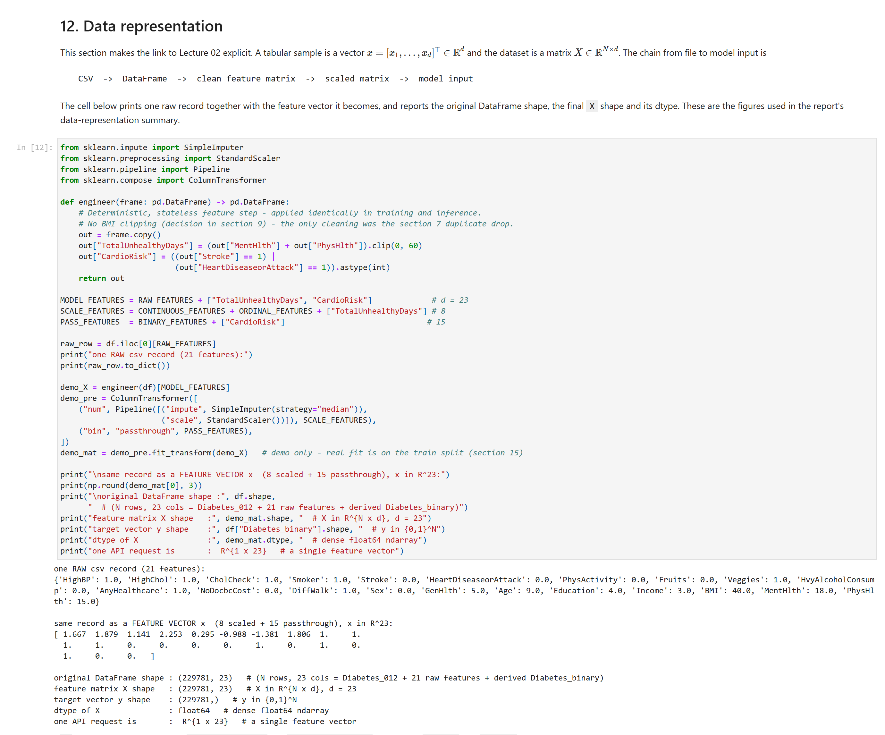{width=80%}

*Hình 4.1 - Tiểu đường: một dòng thô -> vector đặc trưng 23 chiều -> shape / dtype của X
(notebook Mục 12).*

### 4.6 Phân tích khám phá dữ liệu

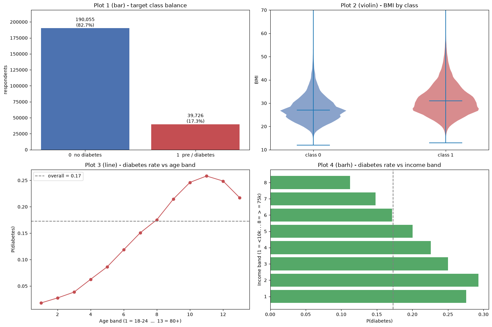{width=80%}

*Hình 4.2 - Tiểu đường: lưới biểu đồ EDA - cân bằng lớp mục tiêu, `GenHlth` vs tỷ lệ tiểu
đường, phân phối `BMI` theo lớp, nhóm `Age` vs tỷ lệ.*

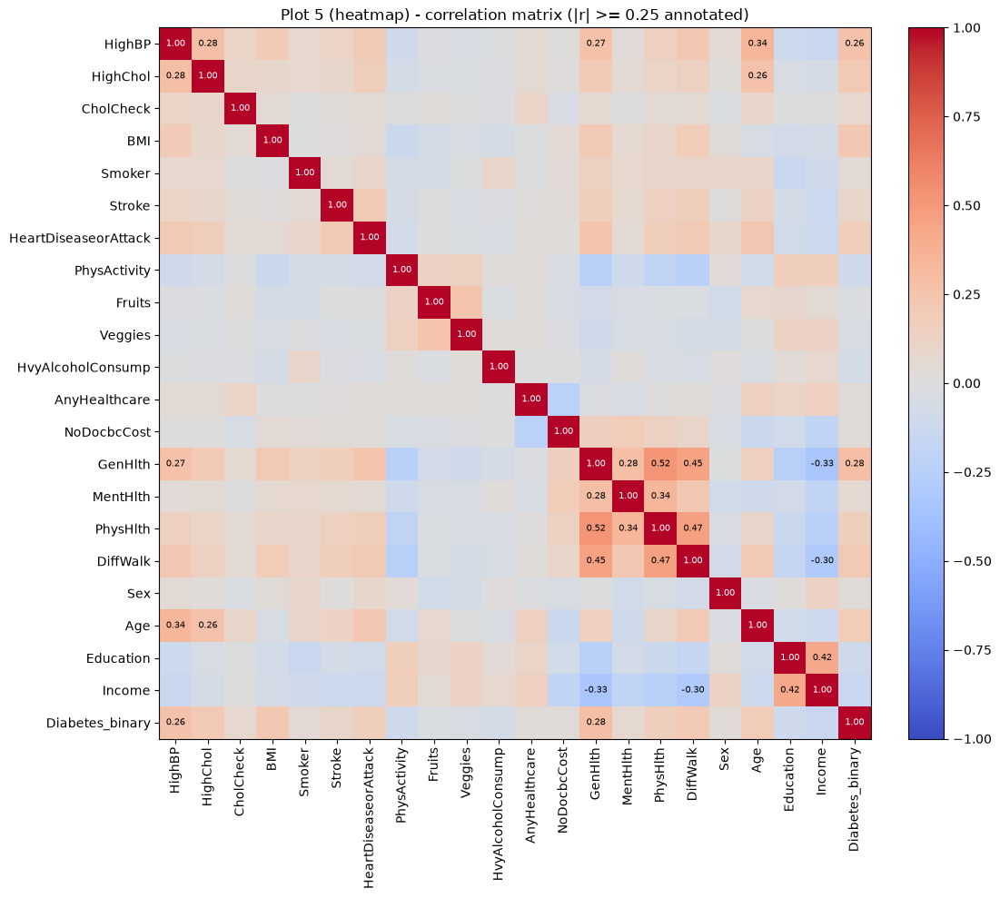{width=72%}

*Hình 4.3 - Tiểu đường: heatmap tương quan đặc trưng / mục tiêu.*

- **Cân bằng lớp** - 17.3 % dương. *Quan sát:* một bộ phân loại theo đa số đã đạt 0.83
  accuracy. *Hàm ý ML:* đánh giá theo recall / F1 / ROC-AUC, không theo accuracy.
- **`GenHlth` vs tỷ lệ tiểu đường** - đơn điệu, ~4 % ở "xuất sắc" đến ~35 % ở "kém". *Diễn
  giải:* tự đánh giá sức khỏe là biến dự báo mạnh nhất. *Hàm ý ML:* giữ `GenHlth` dưới dạng
  số thứ tự.
- **Phân phối `BMI` theo lớp** - người tiểu đường cao hơn ~4 điểm BMI, chồng lấn lớn. *Diễn
  giải:* BMI có ích nhưng không tách được lớp nếu đứng một mình.
- **Nhóm `Age` vs tỷ lệ** - tăng đều theo tuổi. *Hàm ý ML:* giữ `Age` dạng thứ tự.
- **Heatmap tương quan (Hình 4.3)** - `HighBP, HighChol, GenHlth, DiffWalk, Age, BMI` tương
  quan mạnh nhất với mục tiêu; các mục lối sống (`Fruits, Veggies`) gần bằng 0. *Hàm ý ML:*
  giữ tất cả cột (mô hình cây bền vững với đặc trưng yếu); không đặc trưng nào áp đảo.

### 4.7 Phát triển mô hình

Năm mô hình trên cùng một tập con huấn luyện 25 000 dòng có phân tầng và cùng tiền xử lý;
mô hình thắng được fit lại trên toàn bộ tập train.

| Mô hình | Siêu tham số |
|---|---|
| Logistic Regression | `class_weight="balanced", max_iter=1000` |
| Decision Tree | `max_depth=6, min_samples_leaf=50, class_weight="balanced"` |
| Random Forest | `n_estimators=300, max_depth=12, min_samples_leaf=20, class_weight="balanced"` |
| SVM (RBF) | `class_weight="balanced"` |
| KNN | `n_neighbors` mặc định |

**Chia tập:** phân tầng 70/15/15 (`train_test_split` hai lần, seed 42) -> train 160 846 /
val 34 467 / test 34 468, mỗi tập ở tỷ lệ dương 0.1729. Mọi đối tượng fit đều fit trên
`X_train` - tập test không bao giờ ảnh hưởng đến huấn luyện hay việc fit tiền xử lý.

### 4.8 Đánh giá và so sánh mô hình

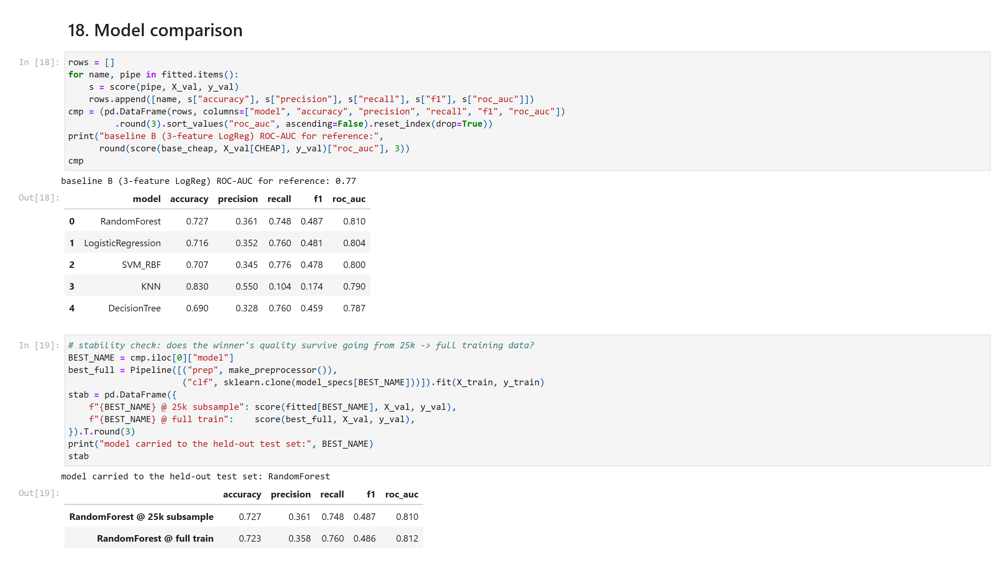{width=80%}

*Hình 4.4 - Tiểu đường: bảng so sánh 5 mô hình và kiểm tra tính ổn định (notebook Mục 18).*

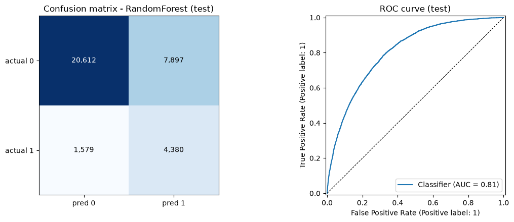{width=80%}

*Hình 4.5 - Tiểu đường: báo cáo phân loại, heatmap ma trận nhầm lẫn và đường cong ROC trên
tập test (notebook Mục 19).*

Validation (fit 25 000 dòng):

| Mô hình | Accuracy | Precision | Recall | F1 | ROC-AUC |
|---|---|---|---|---|---|
| **Random Forest** | 0.727 | 0.361 | 0.748 | 0.487 | **0.810** |
| Logistic Regression | 0.716 | 0.352 | 0.760 | 0.481 | 0.804 |
| SVM (RBF) | 0.707 | 0.345 | 0.776 | 0.478 | 0.800 |
| KNN | 0.830 | 0.550 | 0.104 | 0.174 | 0.790 |
| Decision Tree | 0.690 | 0.328 | 0.760 | 0.459 | 0.787 |
| baseline B (LogReg 3 đặc trưng) | 0.699 | 0.328 | 0.708 | 0.448 | 0.77 |
| baseline A (lớp đa số) | 0.827 | 0.000 | 0.000 | 0.000 | 0.50 |

**Test giữ riêng - Random Forest, fit lại trên toàn bộ train:** accuracy 0.725, ROC-AUC
**0.809**, recall lớp tiểu đường **0.735** (precision 0.357, F1 0.480). **Ma trận nhầm lẫn
`[[20 612, 7 897], [1 579, 4 380]]`:** 1 579 âm tính giả là người tiểu đường bị báo là bình
thường - lỗi nguy hiểm; 7 897 dương tính giả là người khỏe bị cho đi xét nghiệm - một chi
phí, không phải tổn hại. **Chỉ số quan trọng nhất: recall lớp 1.** Bỏ sót một ca tiểu đường
tệ hơn nhiều so với một lần xét nghiệm lãng phí, nên mô hình có class-weight đánh đổi
precision lấy recall một cách có chủ đích, và accuracy tổng (0.725) nằm dưới baseline đa số
0.83.

### 4.9 Chọn mô hình

**Random Forest** - ROC-AUC cao nhất, cân bằng recall/F1 tốt nhất, vượt cả hai baseline, có
`feature_importances_` để diễn giải, huấn luyện ~2 giây, một artifact nhỏ. Logistic
Regression là phương án dự phòng nhẹ đã ghi nhận (ROC-AUC gần như bằng, diễn giải được ở mức
hệ số).

### 4.10 Lưu trữ và triển khai

Lưu tại `diabetes/model/model_pipeline.joblib` = `Pipeline([prep, RandomForestClassifier])`,
cùng `feature_names.joblib` và `input_schema.json`. Bài test suy luận ở Mục 23 nạp lại file
và xác nhận `predict_proba` khớp với mô hình trong bộ nhớ đến 10 chữ số thập phân; ví dụ đầu
vào thô -> `{"prediction": "diabetic", "confidence": 0.8496}`. Triển khai: Mục 8, Phụ lục
D.1 (web), Phụ lục E (mobile).

## 5. Ứng dụng 2 - Dự đoán Giá nhà

### 5.1 Mô tả bài toán

Dự đoán một **mức giá rao hợp lý** từ các thuộc tính bất động sản để một sàn giao dịch có thể
đánh dấu các tin rao sai giá. `X` = thuộc tính bất động sản + vị trí + môi giới; `y = Price`
tính bằng triệu VND, mô hình hóa bằng `log1p(Price)` (độ lệch thô 3.36 -> -0.07) và nghịch
đảo bằng `expm1`. **Hồi quy;** một quan sát = một tin rao. Khác Ứng dụng 1 ở chỗ mục tiêu là
đại lượng dương liên tục, nên các chỉ số là MAE / MSE / RMSE / R^2, không phải
precision/recall.

### 5.2 Bộ dữ liệu

| Trường | Giá trị |
|---|---|
| Tên / URL | **Vietnamese Real Estate Listings 2025** (Kaggle `qmanhbeo/vietnamese-real-estate-listings-may-2024`) |
| Giấy phép / nguồn gốc | **CC BY-NC 4.0**; cào từ các tin rao bán công khai trên Guland.vn, `Scraped At` = 12-14/09/2025; file ~210 MB, không commit |
| Số quan sát | **236 226** thô -> **201 654** sau khi làm sạch |
| Đặc trưng số | `Area, Width, Length, Bedrooms, Bathrooms, Floors, Alley Width, Agent Listing Count` + 3 chỉ báo `*_missing` |
| Đặc trưng phân loại | `Property Type, Position, Direction, Road Type, Province, Agent Role, district` |
| Mục tiêu | `Price` (triệu VND) -> `log1p` |
| Một quan sát | một tin rao, ví dụ `Area=192, Property Type="nhà", Location="Long Xuyên, An Giang", ...` -> `Price=2000` (triệu VND) |

### 5.3 Tìm hiểu và làm sạch dữ liệu

`df.shape = (236 226, ~30)`; `df.info()` tách cột số khỏi cột phân loại/văn bản (các cell
chạy thực tế nằm trong `house_price/notebook/house_price.ipynb`). `df.isna().sum()` cho thấy
**thiếu dữ liệu mang tính cấu trúc** - `Bedrooms` 72 %, `Bathrooms` 84 %, `Floors` 79 %,
`Length` 58 %, `Latitude`/`Longitude` 68 %. Giá trị không hợp lệ: 611 giá không dương và
~10 600 giá phi lý (> 200 000 triệu VND), cùng các diện tích ngoài khoảng.

| Thao tác | Làm gì | Vì sao |
|---|---|---|
| Bỏ dòng bất khả thi | `Price <= 0` hoặc `> 200 000`; `Area <= 0` hoặc `> 10 000` | không phải giá trị thật; sẽ chi phối hàm mất mát |
| Đặc trưng chỉ báo `*_missing` | `Bedrooms_missing, Bathrooms_missing, Floors_missing` | việc một trường bị trống tự nó đã mang thông tin |
| Median-impute phần còn lại, trong pipeline | fit chỉ trên train | một đường code train/suy luận, không rò rỉ |
| Tách `district` từ `Location` | one-hot với `min_frequency = 50` | tỉnh + quận/huyện là yếu tố chi phối giá chính (eta^2 ~ 0.24) |
| Mục tiêu `log1p(Price)` | | độ lệch thô 3.36; QQ-plot thẳng sau `log1p` |
| Bỏ `Listing ID`, `VIP Account` (hằng số), `Title` | | id không rò rỉ gì hữu ích; cột hằng số là vô dụng; **tiêu đề chứa nguyên chuỗi giá tiền** |

### 5.4 Biểu diễn

Frame đã làm sạch `(201 654, 31)` -> `ColumnTransformer`: `SimpleImputer(median) -> log1p ->
StandardScaler` (số); `OneHotEncoder(handle_unknown="ignore", min_frequency=50)` (7 cột phân
loại) -> **`X in R^{201 654 x 92}`** (thưa); `y in R^N` = `log1p(Price)`. Một request API ->
`R^{1 x 92}`; phản hồi nghịch đảo bằng `expm1`.

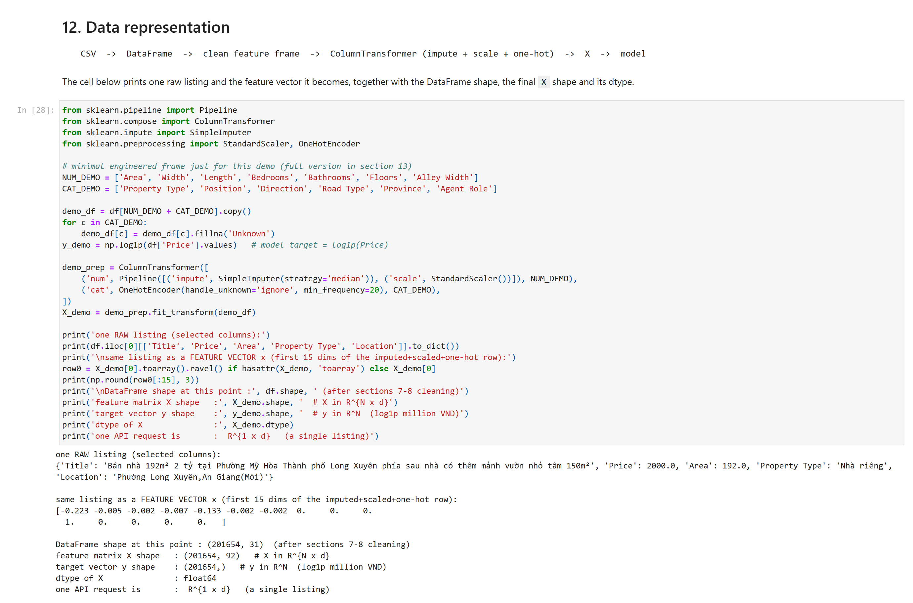{width=80%}

*Hình 5.1 - Giá nhà: một tin rao thô -> hàng đặc trưng 92 chiều -> shape của X / y (notebook
Mục 12).*

### 5.5 Phân tích khám phá dữ liệu

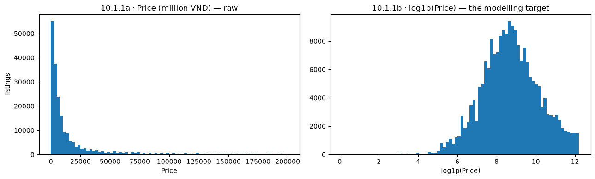{width=72%}

*Hình 5.2 - Giá nhà: phân phối mục tiêu - `Price` thô vs `log1p(Price)`.*

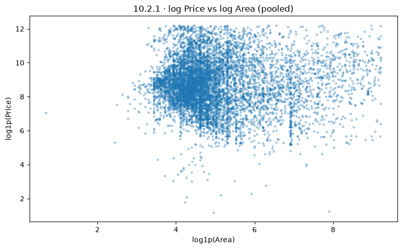{width=72%}

*Hình 5.3 - Giá nhà: heatmap tương quan giữa các đặc trưng số.*

- **Phân phối (10.1)** - `Price` độ lệch thô 3.36 -> `log1p` -0.07; `Area` độ lệch 5.11 ->
  1.32. *Hàm ý ML:* huấn luyện trên `log1p(Price)`, báo cáo chỉ số ngược lại theo thang
  triệu VND.
- **Quan hệ và tương quan (10.2, Hình 5.3)** - **tín hiệu số yếu bất ngờ:** `|r(log Area,
  log Price)| ~ 0.02`, `Bathrooms` 0.215 là số mạnh nhất; tỷ số tương quan phân loại
  `Province` eta^2 ~ 0.24, `Property Type` ~ 0.12. *Diễn giải:* vị trí và loại bất động sản
  mang phần lớn tín hiệu (vốn hạn chế); diện tích thô không đáng tin vì các tin rao trộn lẫn
  đất và nhà xây. *Hàm ý ML:* đây là bài toán hồi quy tín hiệu yếu - dùng mô hình cây tổ hợp
  để nắm cấu trúc vị trí x loại, và R^2 thấp được báo cáo trung thực như một hạn chế dữ liệu.
- **Phân tích hỗ trợ (10.3)** - thiếu dữ liệu theo loại bất động sản biện minh cho các chỉ
  báo `*_missing`; góc nhìn độ lệch/QQ biện minh cho mục tiêu `log1p`.

### 5.6 Mô hình hồi quy và đánh giá

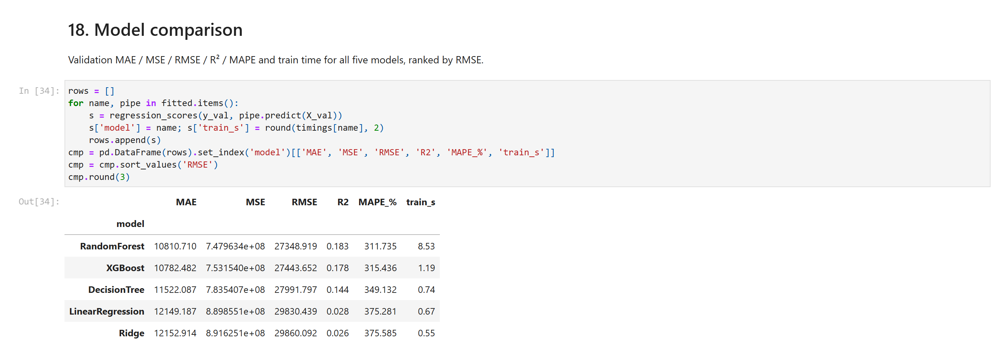{width=80%}

*Hình 5.4 - Giá nhà: bảng so sánh 5 mô hình hồi quy (notebook Mục 18).*

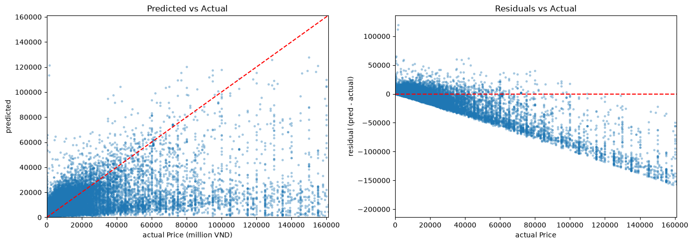{width=80%}

*Hình 5.5 - Giá nhà: scatter dự đoán-vs-thực tế và phần dư-vs-thực tế của Random Forest
(notebook Mục 19).*

Năm mô hình, tập con huấn luyện 50 000 dòng, cùng tiền xử lý:

| Mô hình | val MAE | val RMSE | val R^2 |
|---|---|---|---|
| **Random Forest** | 10 811 | 27 349 | **0.183** |
| XGBoost | 10 794 | 27 478 | 0.176 |
| Decision Tree (`max_depth=12, min_samples_leaf=25`) | 11 522 | 27 992 | 0.144 |
| Linear Regression | 12 149 | 29 830 | 0.028 |
| Ridge | 12 153 | 29 860 | 0.026 |
| baseline (dự đoán trung vị) | 14 397 | 32 185 | -0.131 |

**Test giữ riêng - Random Forest, fit lại trên toàn bộ train:** MAE **10 626**, MSE
722 149 435, RMSE **26 873**, **R^2 0.186**, MAPE 350 % (mọi đơn vị tiền tệ = triệu VND).
*Ý nghĩa từng chỉ số ở đây:* MAE - trung bình mỗi tin rao lệch khoảng 10.6 tỷ VND, lớn vì
khoảng giá trải ba bậc độ lớn; RMSE bằng ~2.5 lần MAE, nên một thiểu số tin rao bị lệch xa
hơn nhiều so với mức điển hình; R^2 0.186 - mô hình giải thích ~19 % phương sai của
`log1p(Price)` vượt trên bộ dự đoán trung bình hằng số (bộ này đạt R^2 = -0.13), nên nó có
thêm tín hiệu thật nhưng phần lớn phương sai giá **không phục hồi được từ các trường này**;
MAPE bị thổi phồng bởi nhiều tin rao giá thấp và chỉ để báo cáo, không dùng để xếp hạng mô
hình. Không có ma trận nhầm lẫn (bài toán hồi quy). **Kết luận trung thực là một bài toán
hồi quy tín hiệu yếu**, do tương quan số gần bằng 0, 70-84 % trường kích thước bị thiếu và
68 % vị trí địa lý bị thiếu - một đặc tính của dữ liệu, không phải của thuật toán.

### 5.7 Chọn mô hình, lưu trữ và triển khai

**Random Forest** - RMSE test thấp nhất, R^2 cao nhất, có `feature_importances_`, ~15 giây
huấn luyện, bagging hấp thụ các outlier giá. Lưu tại
`house_price/model/model_pipeline.joblib` (`Pipeline([prep, RandomForestRegressor])`) +
`feature_names.joblib` + `input_schema.json` (ghi `price_unit = million VND` và quy ước
`log1p`/`expm1`). Bài test suy luận Mục 23: disk == in-memory. Triển khai: Mục 8, Phụ lục
D.2, Phụ lục E.

## 6. Ứng dụng 3 - Hành vi và Sở thích Khách hàng Thương mại Điện tử

### 6.1 Mô tả bài toán

Dự đoán một người viết đánh giá mỹ phẩm Sephora **có gợi ý sản phẩm hay không**, từ **họ là
ai** và **họ viết gì**. Mục tiêu `is_recommended in {0, 1}` - một trường *tách biệt* với
điểm sao 1-5 (điểm sao bị loại vì rò rỉ, Mục 6.6). **Phân loại nhị phân;** một quan sát =
một đánh giá sản phẩm. Hỗ trợ QA nhất quán đánh giá, xếp hạng cold-start và trưng bày hàng.

### 6.2 Bộ dữ liệu

| Trường | Giá trị |
|---|---|
| Tên / URL | **Sephora Products and Skincare Reviews** (Kaggle `nadyinky/sephora-products-and-skincare-reviews`, CC0) |
| File | `reviews_500-750.csv` join với `product_info.csv` trên `product_id` |
| Số quan sát | **116 262** thô -> **104 313** sau khi làm sạch; tỷ lệ dương **0.8465** |
| Phạm vi | 249 sản phẩm / ~79 thương hiệu / 12 giá trị `secondary_category`, tất cả là Skincare |
| Kiểu đặc trưng | 5 số log1p+scale (`price_usd, loves_count, reviews, total_feedback_count, total_neg_feedback_count`), 4 số scale (`n_ingredients, n_highlights, review_age_days, pos_feedback_ratio`), 6 nhị phân passthrough, 6 phân loại one-hot (`skin_type, skin_tone, eye_color, hair_color, secondary_category, brand_name`), 1 văn bản (`review_title + " . " + review_text`) |
| Loại (rò rỉ) | `rating` của chính đánh giá và `rating_product` trung bình của sản phẩm |
| Một quan sát | một đánh giá: hồ sơ da + trường sản phẩm + tiêu đề và nội dung văn bản tự do -> `is_recommended in {0,1}` |

`df.shape = (116 262, ~30)`; `df.isna().sum()` - 11 803 dòng có mục tiêu trống, nhiều trường
hồ sơ da trống; `df.duplicated().sum()` - vài đánh giá trùng hoàn toàn; 125 nội dung trống;
cân bằng lớp **84.7 % dương**. Các cell chạy thực tế nằm trong
`customer_behaviour/notebook/customer_behaviour.ipynb` (Mục 4-9).

### 6.3 Biểu diễn khách hàng

**Tabular:** một đánh giá thô -> 21 cột -> `SimpleImputer(median) -> log1p` (tiền / độ phổ
biến) `-> StandardScaler`; nhị phân passthrough; `OneHotEncoder(handle_unknown="ignore",
min_frequency=25)` -> **`x_tab in R^{138}`**.

**Văn bản - demo bắt buộc `Comment -> Tokens -> Token IDs -> Embedding`** trên một đánh giá
thật:

```
Comment  : "I will be the first to say that the price on these is a lot, but for what they do? ..."
Tokens   : ['say', 'price', 'lot', 'unbeatable', 'deep', 'painful', 'nodules', ...]   (T = 40)
Token IDs: [29, 26, 17, 39, 6, 22, 21, ...]   (chỉ số vào từ vựng 41 dòng, 0 = PAD)
Embedding: mỗi ID -> một dòng của bảng (|V|+1) x d  ->  E in R^{T x d} = R^{40 x 16}
Batch    : E_batch in R^{B x T x d} = R^{1 x 40 x 16}
```

Mô hình **triển khai thực tế** dùng dạng **TF-IDF** thưa (`ngram_range=(1,2)`, `min_df=10`,
`max_features=40000`, `sublinear_tf`, stop-words tiếng Anh) -> `x_txt in R^{28 595}` trên từ
vựng tập huấn luyện. **Ghép lại:** `X = [x_tab || x_txt] in R^{104 313 x 28 733}` thưa.

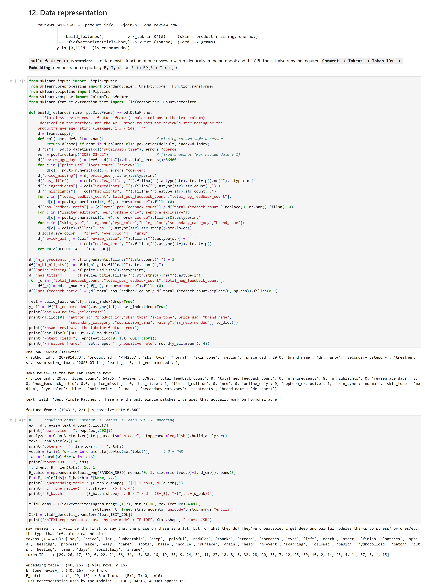{width=80%}

*Hình 6.1 - Hành vi khách hàng: một đánh giá thô -> hàng tabular và khối TF-IDF của nó, cùng
demo embedding `B = 1, T = 40, d = 16` (notebook Mục 12).*

### 6.4 Làm sạch dữ liệu

Bỏ 11 803 dòng mục tiêu trống, 125 nội dung trống và vài dòng trùng (116 262 -> 104 313).
Trường hồ sơ da trống -> một mức one-hot `__na__` rõ ràng (việc thiếu là một hành vi thật).
Khoảng trống số ngẫu nhiên -> `SimpleImputer(median)` fit **chỉ trên train**. Viết thường tất
cả cột phân loại; gộp `eye_color "grey" -> "gray"`. Giữ nguyên outlier (`log1p` xử lý độ
lệch). Từ vựng TF-IDF được xây **chỉ trên train**. `rating` / `rating_product` của chính
đánh giá bị cách ly cho demo rò rỉ.

### 6.5 Khám phá sở thích / EDA

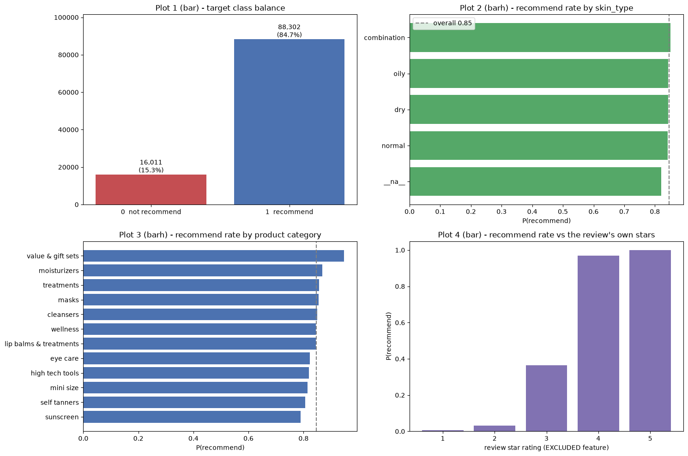{width=80%}

*Hình 6.2 - Hành vi khách hàng: lưới biểu đồ EDA - cân bằng lớp, tỷ lệ gợi ý theo loại
da / danh mục / thương hiệu / decile giá, tỷ lệ gợi ý vs điểm sao bị loại.*

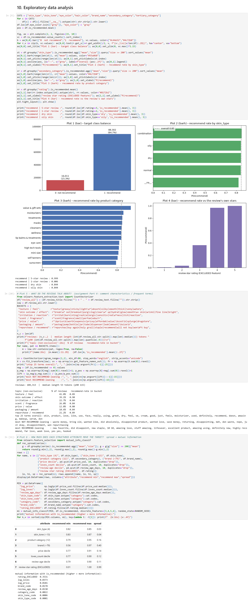{width=80%}

*Hình 6.3 - Hành vi khách hàng: tỷ lệ gợi ý theo nhóm chủ đề và mutual information với mục
tiêu.*

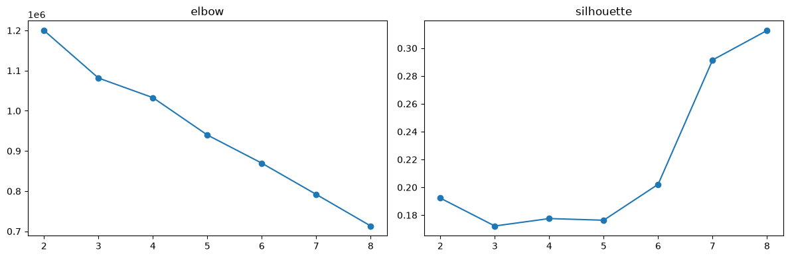{width=60%}

*Hình 6.4 - Phân khúc khách hàng (K-Means): elbow và silhouette (notebook Phụ lục B).*

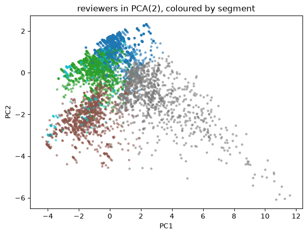{width=60%}

*Hình 6.5 - Phân khúc khách hàng (K-Means): hồ sơ 5 phân khúc và scatter PCA.*

- **Cân bằng lớp** 84.7 % gợi ý. Độ trải tỷ lệ gợi ý theo loại da ~0.03, theo danh mục
  ~0.16, theo thương hiệu ~0.40, theo decile giá ~0.14; so với điểm sao *bị loại* thì chạy
  từ 0.01 -> 1.00. *Diễn giải:* mức khớp giữa khách hàng và sản phẩm là tín hiệu thật nhưng
  yếu; điểm sao về bản chất chính là nhãn. *Hàm ý ML:* `class_weight="balanced"`, nhóm việc
  chia tập theo `author_id`, cách ly `rating`, kỳ vọng văn bản mang phần lớn kỹ năng.
- **Nhóm chủ đề (Hình 6.3)** - kết cấu/cảm giác ~42 % đánh giá (gợi ý 0.89), kết quả
  da/nổi mụn ~39 % (0.90), kích ứng ~23 %, mùi hương ~26 %, giá ~13 %. **Mutual
  information** với mục tiêu: `rating` bị loại 0.35, `log_loves` 0.037, `log_price`/`brand`
  0.018, `secondary_category` 0.002, các trường da ~0. *Diễn giải:* nội dung người viết
  nói về điều gì thì dự báo được việc gợi ý; nhân khẩu học thì không.
- **Phân khúc khách hàng (K-Means, Hình 6.4-6.5)** - người viết `x_i = [R_i, F_i, M_i,
  avg_price_i, recommend_rate_i, avg_rating_i, C_i1..C_ik]`; 73 819 người viết, `F >= 2` cho
  22 %, `k = 5` từ elbow/silhouette. Chỉ để mô tả; không đưa vào bộ phân loại.

### 6.6 Rò rỉ dữ liệu

1. **Văn bản đánh giá được viết cùng lúc với nhãn** - `is_recommended` là một checkbox trên
   cùng biểu mẫu với ô văn bản tự do, nên một mô hình văn bản phần nào *đọc* được phán quyết;
   con số ~0.965 là chặn trên hồi cứu (không phải rò rỉ thuần túy - văn bản cũng mang trải
   nghiệm sản phẩm, và tab+text vẫn trụ vững qua phép chia theo thời gian ở mức ~0.96).
2. **`rating` điểm sao của chính đánh giá CHÍNH LÀ nhãn ở một cột khác** - thêm nó vào ->
   ROC-AUC **~0.985** (MI 0.35). Bị loại. `rating` trung bình của sản phẩm nhẹ hơn (0.768 ->
   0.789) nhưng cũng bị loại vì nhìn trước tương lai (look-ahead).
3. **Các đếm tương tác là hậu-xuất-bản** - giữ lại cho mô hình hồi cứu này; một biến thể
   hướng tương lai bỏ chúng đi thì rơi xuống ROC-AUC ~0.66.

Không đối tượng tiền xử lý nào được fit trên validation, test hay đầu vào người dùng - API
triển khai nạp đúng pipeline đã fit trên `X_train`.

### 6.7 Phát triển mô hình

**Tám pipeline** - sáu mô hình theo yêu cầu của đề cho Ứng dụng 3 (Logistic Regression,
Decision Tree `max_depth=12`, Random Forest `n_estimators=350`, Linear SVM `LinearSVC C=0.5`,
`SGD(loss="log_loss")` làm bộ phân loại tuyến tính dựa trên văn bản, `HistGradientBoosting`
làm mô hình bổ sung có biện minh) cộng Complement Naive Bayes và Logistic Regression triển
khai trên tabular + text. Tất cả đều class-weighted; siêu tham số cố định; fit chỉ trên tập
train. **Chia tập:** `StratifiedGroupKFold(5)` nhóm theo `author_id` (không người viết nào
nằm ở hai tập) -> train 62 587 / val 20 862 / test 20 864, mỗi tập ở tỷ lệ gợi ý 0.8465.

**Thang biểu diễn** (một Logistic Regression, tăng dần đặc trưng, ROC-AUC validation): hồ sơ
da 0.536 -> + sản phẩm 0.656 -> tabular đầy đủ 0.768 -> chỉ văn bản 0.965 ->
**tabular + văn bản 0.966**.

| Mô hình | Biểu diễn | ROC-AUC | macro-F1 | recall(0) | Accuracy |
|---|---|---|---|---|---|
| **Logistic Regression (tab + text)** | kết hợp | **0.966** | **0.861** | **0.885** | 0.919 |
| HistGradientBoosting | tabular | 0.811 | 0.664 | 0.678 | 0.771 |
| Random Forest | tabular | 0.810 | 0.686 | 0.611 | 0.806 |
| Logistic Regression | tabular | 0.768 | 0.622 | 0.679 | 0.722 |
| Decision Tree | tabular | 0.767 | 0.637 | 0.649 | 0.746 |
| Linear SVM | tabular | 0.767 | 0.622 | 0.676 | 0.723 |
| SGD (log-loss, text) | text | 0.965 | 0.856 | 0.885 | 0.916 |
| Complement Naive Bayes | text | 0.955 | 0.840 | 0.846 | 0.907 |
| baseline (lớp đa số) | | 0.500 | 0.458 | 0.000 | 0.847 |

**Tabular vs tabular + text - câu hỏi then chốt của đề bài.** Cả hai biểu diễn đều mang kỹ
năng thật (tabular ~0.77 tuyến tính / ~0.81 cây). Chỉ riêng văn bản đánh giá đã đạt ~0.965;
thêm nó vào khối tabular chỉ cho một mức tăng nhỏ, nhất quán (macro-F1 0.856 -> 0.861). Hai
biểu diễn **thừa nhau hơn là bổ sung** - một khách hàng sẽ không gợi ý thường đã nói điều đó
trong đánh giá rồi.

### 6.8 Đánh giá và phân tích lỗi

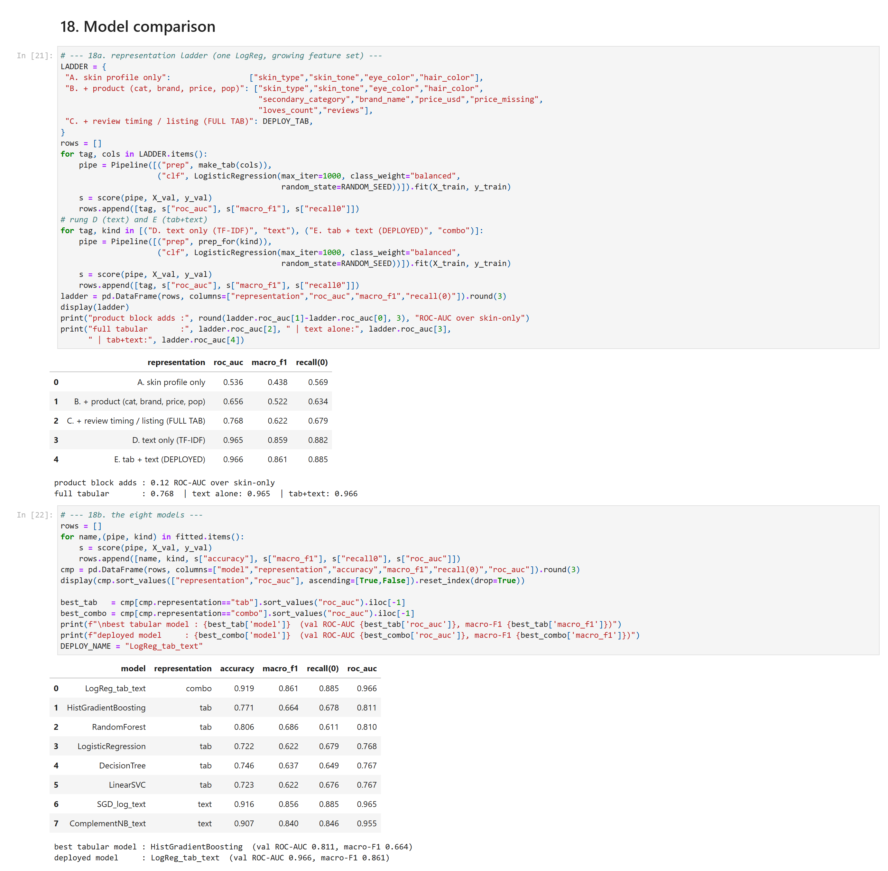{width=80%}

*Hình 6.6 - Hành vi khách hàng: thang biểu diễn và bảng so sánh 8 mô hình (notebook Mục 18).*

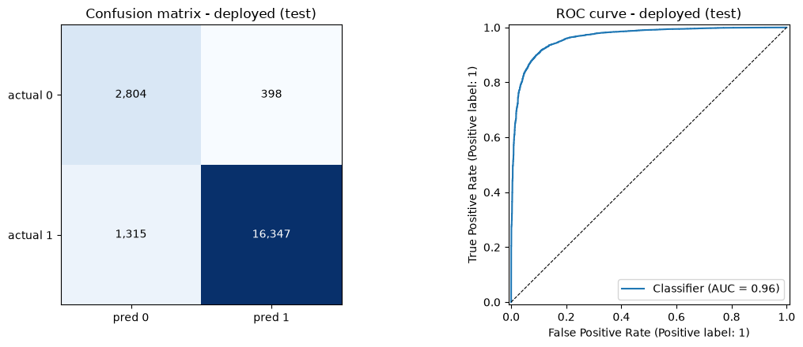{width=80%}

*Hình 6.7 - Hành vi khách hàng: báo cáo phân loại, heatmap ma trận nhầm lẫn và đường cong
ROC của Logistic Regression triển khai trên tabular + văn bản TF-IDF (notebook Mục 19).*

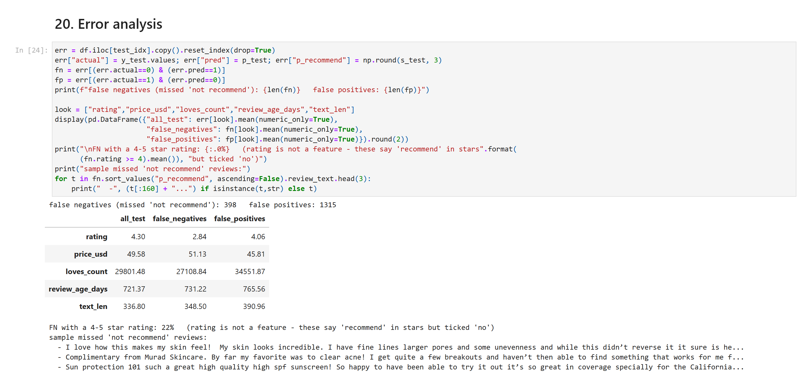{width=80%}

*Hình 6.8 - Hành vi khách hàng: so sánh đặc trưng âm tính giả / dương tính giả kèm đánh giá
bị bỏ sót mẫu (notebook Mục 20).*

Logistic Regression triển khai (tab + text), test giữ riêng (`N = 20 864`): accuracy
**0.918**, ROC-AUC **0.964**, recall lớp "không gợi ý" **0.876** (precision 0.681, F1
0.766). Từng biểu diễn đơn trên cùng tập test: chỉ tabular 0.801, chỉ văn bản 0.963. **Ma
trận nhầm lẫn `[[2 804, 398], [1 315, 16 347]]`:** 1 315 âm tính giả là khách hàng sẽ không
gợi ý nhưng bị dự đoán là có gợi ý - một trang sản phẩm gây hiểu lầm; 398 dương tính giả là
khách hàng hài lòng bị đánh dấu để QA - rẻ. **Chỉ số quan trọng nhất: recall lớp 0.**
Accuracy không phải điểm nhấn - baseline đa số đã đạt 0.847 mà không bắt được người viết
không hài lòng nào. **Phân tích lỗi:** 22 % âm tính giả mang điểm 4-5 sao - một đánh giá đọc
có vẻ tích cực nhưng có phủ quyết ẩn, đó là trần không thể vượt của một mô hình văn bản.

### 6.9 Diễn giải nghiệp vụ

Việc một khách hàng có gợi ý hay không **chủ yếu nằm ở những gì họ viết** (văn bản ~0.965);
mức khớp có cấu trúc giữa khách hàng và sản phẩm là tín hiệu thật nhưng yếu hơn, thừa (~0.8).
Ứng dụng: **QA nhất quán đánh giá** (đánh dấu "5 sao" + "sẽ không mua lại"), **xếp hạng
cold-start** từ mô hình chỉ tabular (không cần văn bản, ~0.8), **trưng bày hàng** cho các
danh mục có tỷ lệ gợi ý thấp. Mô hình mang tính hồi cứu (cần có đánh giá), nên giá trị của nó
là góc nhìn *có cấu trúc*, không phải mức nhỉnh nhỏ về accuracy so với một bộ phân loại văn
bản thuần.

### 6.10 Lưu trữ và triển khai

Lưu tại `customer_behaviour/model/model_pipeline.joblib` (`ColumnTransformer` +
`TfidfVectorizer` + `LogisticRegression`, ~2 MB) + `feature_names.joblib` +
`feature_means.joblib` (tham chiếu linear-SHAP) + `input_schema.json`. `POST /predict` trả
về `{prediction, confidence, p_recommend, threshold, review_terms, signals, contributions,
model, representation}`, trong đó `contributions` là một phân rã linear-SHAP chính xác. Bài
test suy luận Mục 23: reload == in-memory; đánh giá tích cực -> `p_recommend = 0.9376`, tiêu
cực -> `0.0026`. Triển khai: Mục 8, Phụ lục D.3, Phụ lục E.

## 7. So sánh Ba Hệ thống Thông minh

| Khía cạnh | Tiểu đường | Giá nhà | Hành vi khách hàng |
|---|---|---|---|
| Loại bài toán | Phân loại | Hồi quy | Phân loại |
| Một quan sát | một người trả lời khảo sát | một tin rao bất động sản | một đánh giá sản phẩm |
| Mục tiêu | `Diabetes_binary in {0,1}` | `Price in R+` (dạng `log1p`) | `is_recommended in {0,1}` |
| Biểu diễn đầu vào | `R^{N x 23}` scaled + passthrough | `R^{N x 92}` impute + scale + one-hot (thưa) | `R^{N x 28 733}` tabular + văn bản TF-IDF (thưa) |
| Vấn đề chất lượng dữ liệu | 23 899 dòng trùng; mất cân bằng 17 %; đuôi BMI | 70-84 % trường kích thước thiếu; ~11 000 giá phi lý; tương quan số gần 0; tiêu đề rò rỉ giá | ~10 % mục tiêu trống; mất cân bằng 85 %; trường hồ sơ da thiếu; văn bản viết cùng lúc với nhãn |
| Mô hình tốt nhất | Random Forest | Random Forest | Logistic Regression (tab + text) |
| Chỉ số chính | recall lớp tiểu đường - **0.735** ở ROC-AUC 0.809 | RMSE **26 873** / R^2 **0.186** | recall lớp "không gợi ý" - **0.876** ở ROC-AUC 0.964 |
| Triển khai web | Có | Có | Có (wizard 3 bước) |
| Triển khai mobile | Có | Có | Có |
| Hạn chế chính | recall đổi bằng precision thấp 0.36; tự khai báo khảo sát | tín hiệu giá yếu (R^2 ~ 0.19); cần vị trí mịn hơn cấp tỉnh | văn bản viết cùng lúc với tick gợi ý (~0.96 phần nào rò rỉ; tabular an toàn ~0.8); chỉ hồi cứu |

**Thảo luận.** Ba bộ dữ liệu cần ba biểu diễn khác nhau: một ma trận scaled thuần, một ma
trận one-hot đã impute, và một ma trận ghép với các vector văn bản thưa. Phần tiền xử lý
chung là median imputation fit trên train, scaling, một phép chia phân tầng hoặc nhóm theo
tác giả, và một `Pipeline` được lưu; phần riêng theo ứng dụng là mục tiêu `log1p` và các chỉ
báo `*_missing` (giá nhà), việc loại dòng trùng và các cờ rủi ro engineered (tiểu đường), và
`OneHotEncoder(min_frequency)` + `TfidfVectorizer` + chia nhóm theo tác giả + mục rò rỉ (hành
vi khách hàng). Các mục tiêu khác nhau vì câu hỏi khác nhau ("có đúng không?" / "bao nhiêu?"
/ "họ có ủng hộ không?"), đó là lý do một bộ phân loại được đánh giá theo ma trận nhầm lẫn và
ROC-AUC còn một bộ hồi quy được đánh giá theo độ lớn sai số và phương sai được giải thích.
Tiểu đường dễ triển khai nhất (23 đầu vào số, không văn bản); hành vi khách hàng tốn tính
toán nhất (một ma trận tabular+text thưa ~28 700 chiều, một từ vựng TF-IDF phải kèm theo, và
tám mô hình).

## 8. Kiến trúc Triển khai

Cả ba ứng dụng đi theo cùng một đường suy luận:

```
Đầu vào người dùng  ->  Request API  ->  Validation  ->  CÙNG tiền xử lý (đã nạp)  ->  Mô hình đã lưu  ->  Dự đoán  ->  JSON
```

1. **Mô hình đã huấn luyện** - nạp từ `model/model_pipeline.joblib`, **không bao giờ huấn
   luyện lại** lúc có request.
2. **Pipeline tiền xử lý** - đúng `ColumnTransformer` / `Pipeline` đã fit trên tập train,
   lưu bên trong cùng một object.
3. **Endpoint API** - FastAPI `POST /predict` (cùng `GET /healthz`, `GET /model-info`,
   `GET /questions` để client dựng biểu mẫu).
4. **Validation đầu vào** - một schema Pydantic (kiểu, khoảng); trường tùy chọn bị thiếu sẽ
   được median-impute bởi pipeline.
5. **Dự đoán** - `pipeline.predict_proba` (phân loại) hoặc `expm1(pipeline.predict)` (hồi
   quy giá nhà).
6. **Kết quả** - JSON: `{prediction, confidence}` / `{predicted_price}` /
   `{prediction, p_recommend, contributions, ...}`.
7. **Giao diện web** - biểu mẫu React + Vite -> `fetch` -> màn hình kết quả với phán quyết
   ngôn ngữ đời thường.
8. **Giao diện mobile** - biểu mẫu Flutter -> gọi REST -> màn hình kết quả. `Training !=
   Inference`: ứng dụng mobile không huấn luyện gì cả, nó gọi cùng endpoint.

**Quy tắc chống rò rỉ.** Dịch vụ nạp pipeline tiền xử lý *đã fit trên dữ liệu train* và
**không bao giờ gọi `.fit()`** khi có request; một scaler fit lại trên một request sẽ chuẩn
hóa request đó với chính nó. Huấn luyện và suy luận áp dụng các phép biến đổi giống hệt nhau
- được kiểm chứng bởi bài test suy luận Mục 23 của mỗi notebook (disk == in-memory).

Tóm tắt request/response theo từng ứng dụng:

| Ứng dụng | Endpoint | Ví dụ đầu vào | Ví dụ đầu ra |
|---|---|---|---|
| Tiểu đường | `POST :8000/predict` | `{Age, Sex, HighBP, HighChol, BMI, GenHlth, DiffWalk, ...}` | `{"prediction": "at risk", "confidence": 0.82, "band": "High"}` |
| Giá nhà | `POST :8002/predict` | `{Area, "Property Type", Province, district, Bedrooms, ...}` | `{"predicted_price": 2540.82, "price_per_m2": 32.28, "currency": "million VND"}` |
| Hành vi khách hàng | `POST :8000/predict` | `{skin_type, secondary_category, brand_name, price_usd, review_title, review_text}` (không gửi `rating`) | `{"prediction": "not recommend", "p_recommend": 0.0026, "review_terms": {...}, "contributions": [...]}` |

{width=70%}

*Hình 8.1 - Màn hình end-to-end tiêu biểu (client web giá nhà). Người dùng nhập thuộc tính
bất động sản; trang `POST` chúng đến `/predict`; API chạy pipeline đã nạp và Random Forest,
nghịch đảo `log1p` bằng `expm1`, và trả về giá; màn hình kết quả hiển thị giá trị (khoảng
9.90 tỷ VND), một khoảng thấp-cao, một biểu đồ waterfall đóng góp SHAP và một tóm tắt bằng
ngôn ngữ đời thường.*

Toàn bộ ảnh chụp web và mobile (màn hình nhập, màn hình kết quả và, với web, trang FastAPI
`/docs`) của mọi ứng dụng, mỗi ảnh kèm một ghi chú Giải thích hình theo yêu cầu của đề bài,
nằm ở **Phụ lục D** (web) và **Phụ lục E** (mobile). Mỗi lần chạy mobile đều ghi một
`POST /predict 200` trên server - bằng chứng giao tiếp bắt buộc.

## 9. Khả năng tái lập

| Mục | Tiểu đường | Giá nhà | Hành vi khách hàng |
|---|---|---|---|
| Python / OS | 3.13 / Windows 11 | 3.13 / Windows 11 | 3.13 / Windows 11 |
| Thư viện chính | scikit-learn 1.9.0, numpy, pandas, scipy, matplotlib; fastapi + uvicorn + pydantic 2 | + xgboost | + React 18 + Vite 5; Flutter 3.19+ |
| Random seed | `RANDOM_SEED = 42` (numpy + `random`, mọi phép chia và estimator) | như trên | như trên |
| Bộ dữ liệu | Kaggle `alexteboul/...`, `diabetes_012_health_indicators_BRFSS2015.csv` - đã commit | Kaggle `qmanhbeo/...` (CC BY-NC 4.0) - không commit (~210 MB) | Kaggle `nadyinky/...` (CC0) - không commit (~505 MB); `reviews_500-750.csv` + `product_info.csv` |
| Số dòng (thô -> sạch) | 253 680 -> 229 781 | 236 226 -> 201 654 | 116 262 -> 104 313 |
| Chia tập | phân tầng 70/15/15 (160 846 / 34 467 / 34 468) | 70/15/15 (141 157 / 30 248 / 30 249) | `StratifiedGroupKFold(5)` trên `author_id` (62 587 / 20 862 / 20 864) |
| Tiền xử lý | `SimpleImputer(median)` -> `StandardScaler` (8 cột) + passthrough (15) | `SimpleImputer(median)` -> `log1p` -> `StandardScaler`; `OneHotEncoder(min_frequency=50)` | + `OneHotEncoder(min_frequency=25)`; `TfidfVectorizer(ngram_range=(1,2), min_df=10, max_features=40000, sublinear_tf, stop_words="english")` - tất cả fit chỉ trên train |
| Số chiều đặc trưng `d` | 23 | 92 | 28 733 (thưa) |
| Mô hình | `RandomForestClassifier(max_depth=12, min_samples_leaf=20, class_weight="balanced", random_state=42)` | `RandomForestRegressor(random_state=42)` trên `log1p(Price)` | `LogisticRegression(C=1.0, class_weight="balanced", random_state=42)` trên tabular + TF-IDF |
| Chỉ số test | Acc 0.725 / recall(1) 0.735 / ROC-AUC 0.809 / conf `[[20612,7897],[1579,4380]]` | MAE 10 626 / RMSE 26 873 / R^2 0.186 | Acc 0.918 / macro-F1 0.858 / ROC-AUC 0.964 / recall(0) 0.876 / conf `[[2804,398],[1315,16347]]` |
| Artifact đã lưu | `model_pipeline.joblib`, `feature_names.joblib`, `input_schema.json` | như trên | + `feature_means.joblib` |
| Cách tái lập | `pip install -r requirements.txt` -> chạy notebook (ghi `model/`) -> `python -m uvicorn api.main:app` -> `npm --prefix web run dev` -> `flutter run` trong `mobile/` |

```python
import numpy as np, random
RANDOM_SEED = 42
np.random.seed(RANDOM_SEED); random.seed(RANDOM_SEED)
```

Bố cục repository: Phụ lục A. Cấu trúc notebook: Phụ lục B. Đặc tả API: Phụ lục C. Checklist
nộp bài: Phụ lục F.

## 10. Thảo luận So sánh Tổng kết

Bảng so sánh và các câu trả lời "các bộ dữ liệu / biểu diễn / chỉ số khác nhau như thế nào"
nằm ở Mục 7. Mục này bàn những phần vượt ra ngoài bảng đó.

**Mô hình nào tốt nhất, và có triển khai tốt nhất không?** Random Forest (tiểu đường, giá
nhà) và Logistic Regression trên tabular + text (hành vi khách hàng). Ở cả ba, mô hình tốt
nhất cũng là mô hình triển khai tốt nhất: mỗi cái là một `Pipeline` scikit-learn duy nhất,
chỉ CPU, mili-giây mỗi dự đoán, một artifact nhỏ.

**Các dạng rò rỉ dữ liệu đã xét.** (a) Một scaler, encoder hay vectoriser fit lại lúc suy
luận - tránh bằng cách nạp pipeline đã fit và không bao giờ gọi `.fit()`. (b) Một dòng trùng
chung cho cả train và test - 23 899 dòng trùng của tiểu đường bị bỏ *trước khi* chia tập. (c)
Một cột chứa mục tiêu - `Title` của giá nhà chứa chuỗi giá và bị bỏ. (d) Điểm sao `rating`,
vốn *chính là* nhãn gợi ý - bị cách ly; thêm nó lại đẩy ROC-AUC lên ~0.985. (e) Các đếm
tương tác chỉ tồn tại sau xuất bản - giữ cho mô hình hồi cứu hành vi khách hàng nhưng có ghi
chú, và một biến thể hướng tương lai bỏ chúng đi thì rơi xuống ~0.66.

**Thông tin bị mất và được giữ khi biểu diễn.** One-hot encoding làm mất thứ tự của các danh
mục định danh nhưng giữ được danh tính; `log1p` trên các cột tiền làm mất thang thô nhưng giữ
được thứ hạng và làm mục tiêu gần đối xứng; TF-IDF làm mất trật tự từ và cú pháp nhưng giữ
được từ nào là đặc trưng; `min_frequency` gộp các danh mục hiếm, mất danh tính đuôi để kiểm
soát số chiều. Điều được giữ trong mọi trường hợp là thông tin mà mô hình được chọn thực sự
dùng được.

**Hạn chế còn lại.** Tiểu đường: recall đổi bằng precision 0.36, và dữ liệu là một quốc gia
và một năm câu trả lời khảo sát tự khai. Giá nhà: mô hình chỉ giải thích ~19 % phương sai vì
bộ dữ liệu gần như không có tín hiệu số và vị trí thô; muốn kết quả tốt hơn cần vị trí cấp
đường phố và các tham chiếu giá-trên-m^2. Hành vi khách hàng: điểm văn bản nổi bật phần nào
là rò rỉ và mô hình mang tính hồi cứu (cần đánh giá đã hoàn thành).

**Điều sẽ cải thiện nếu có thêm thời gian.** Ngưỡng đã hiệu chỉnh và quyết định trọng số theo
chi phí cho tiểu đường; join dữ liệu vị trí / giá-trên-m^2 bên ngoài cho giá nhà; một mô hình
văn bản cấp khía cạnh và một lượt kéo đa danh mục (để phục hồi phương sai Frequency của RFM)
cho hành vi khách hàng; và một thư viện nội bộ dùng chung cho ba đường code
`build_features()` / schema / suy luận để thay đổi một lần là xong.

## 11. Kết luận

```
Dữ liệu thô  ->  Làm sạch  ->  Biểu diễn  ->  Học  ->  Đánh giá  ->  Lưu trữ  ->  Triển khai
```

Một hệ thống thông minh triển khai được là **dữ liệu + biểu diễn + học + đánh giá + phần
mềm + triển khai + tương tác người dùng**, không chỉ là một mô hình đã huấn luyện.

1. **Bài học chính** - phần lớn công việc và phần lớn rủi ro nằm ở việc biến dữ liệu thô
   thành một biểu diễn đúng, tái lập được; mô hình là bước cuối nhỏ.
2. **Thách thức kỹ thuật lớn nhất** - xây **một** object tiền xử lý được fit một lần trên dữ
   liệu train và áp dụng giống hệt trong notebook, trong API và trong các test.
3. **Vấn đề biểu diễn dữ liệu quan trọng nhất** - quyết định mỗi cột thô *là gì* (một đặc
   trưng thật, một chỗ rò rỉ, một tín hiệu hậu-kỳ, một id) trước khi mã hóa nó - thấy rõ nhất
   ở phân tích rò rỉ của Ứng dụng 3.
4. **Bài học ML quan trọng nhất** - accuracy là điểm nhấn sai trên dữ liệu mất cân bằng hoặc
   tín hiệu yếu; ma trận nhầm lẫn, recall lớp quan trọng, và R^2 so với một baseline ngây thơ
   mới kể được câu chuyện thật.
5. **Bài học triển khai quan trọng nhất** - `Training != Inference`: dịch vụ nạp pipeline đã
   fit và không bao giờ fit lại.
6. **Một cải tiến tương lai** - một thư viện nội bộ dùng chung cho ba đường code
   feature-build / schema / suy luận.

## Phụ lục A - Bố cục Repository

```
assignment_02/
  Report_Deliverable.md / report/Report_Deliverable.docx     báo cáo này
  report/screenshots/                                        toàn bộ hình + README chỉ mục
  diabetes/  house_price/  customer_behaviour/               mỗi ứng dụng một thư mục, gồm:
    data/            bộ dữ liệu (hoặc ghi chú cách tải) + data/README.md
    notebook/        notebook Jupyter 23 mục (0 cell lỗi)
    model/           model_pipeline.joblib (tiền xử lý + mô hình trong một object),
                     feature_names.joblib, input_schema.json  [+ feature_means.joblib cho App 3]
    api/             dịch vụ FastAPI - main.py, schema.py, inference.py, config.py, requirements.txt
    web/             client React + Vite - src/, package.json, README.md
    mobile/          client Flutter - lib/, pubspec.yaml, README.md
    requirements.txt
  README.md                                                  cách tái lập mọi hệ thống
```

## Phụ lục B - Checklist Cấu trúc Notebook

Mỗi notebook ứng dụng chứa đủ 23 mục yêu cầu và chạy từ trên xuống dưới không có cell lỗi.

| # | Mục | Tiểu đường | Giá nhà | Hành vi khách hàng |
|---|---|---|---|---|
| 1 | Problem definition | Có | Có | Có |
| 2 | Dataset source | Có | Có | Có |
| 3 | Dataset loading | Có | Có | Có |
| 4 | Dataset inspection | Có | Có | Có |
| 5 | Data-quality analysis | Có | Có | Có |
| 6 | Missing-value analysis | Có | Có | Có |
| 7 | Duplicate analysis | Có | Có | Có |
| 8 | Invalid-value analysis | Có | Có | Có |
| 9 | Outlier analysis | Có | Có | Có |
| 10 | Exploratory data analysis | Có | Có | Có |
| 11 | Feature types | Có | Có | Có |
| 12 | Data representation | Có | Có | Có |
| 13 | Feature engineering | Có | Có | Có |
| 14 | Train / validation / test split | Có | Có | Có (+ 14a rò rỉ) |
| 15 | Preprocessing pipeline | Có | Có | Có |
| 16 | Baseline model | Có | Có | Có |
| 17 | Model training | Có | Có | Có |
| 18 | Model comparison | Có (5 mô hình) | Có (5 mô hình) | Có (8 mô hình) |
| 19 | Evaluation | Có | Có | Có |
| 20 | Error analysis | Có | Có | Có |
| 21 | Model selection | Có | Có | Có |
| 22 | Model persistence | Có | Có | Có |
| 23 | Inference test | Có | Có | Có |

## Phụ lục C - Đặc tả Endpoint API

Luồng cho mọi ứng dụng: `JSON đầu vào -> Validation Pydantic -> tiền xử lý đã nạp -> mô hình
-> JSON đầu ra`. Dịch vụ không bao giờ gọi `.fit()`.

| | Tiểu đường | Giá nhà | Hành vi khách hàng |
|---|---|---|---|
| Framework | FastAPI + Uvicorn | FastAPI + Uvicorn | FastAPI + Uvicorn |
| Cổng | 8000 | 8002 | 8000 |
| Endpoint dự đoán | `POST /predict` (tùy chọn `?include=explain,similar,whatif`) | `POST /predict` | `POST /predict`, `POST /predict/batch` |
| Endpoint hỗ trợ | `GET /healthz`, `/model-info`, `/questions`, `/metrics`, `/threshold-curve` | `GET /healthz` | `GET /healthz`, `/model-info`, `/questions`, `/samples` |
| Hàm dự đoán | `pipeline.predict_proba` | `expm1(pipeline.predict)` | `pipeline.predict_proba` + linear-SHAP |
| Khóa đầu ra | `prediction, confidence, band, contributions` | `predicted_price, price_per_m2, currency, model, contributions` | `prediction, confidence, p_recommend, threshold, review_terms, signals, contributions, model, representation` |

Giao diện Swagger tương tác được phục vụ tại route `/docs` của mỗi dịch vụ, với `POST
/predict` đã mở rộng, và ghi lại schema request và response.

## Phụ lục D - Báo cáo Ứng dụng Web

Ba client web dùng chung một thiết kế - React 18 + Vite, `axios`, **không có mô hình trong
trình duyệt**: mỗi client dựng biểu mẫu từ `GET /questions`, `POST` các trường đã nhập đến
`/predict`, và hiển thị dự đoán trả về kèm diễn giải bằng ngôn ngữ đời thường.

### D.1 Ứng dụng Web - Tiểu đường

| Mục | Giá trị |
|---|---|
| Framework | React 18 + Vite; dev server proxy `/api` sang dịch vụ FastAPI |
| Endpoint API | `POST http://localhost:8000/predict` |
| Biến đầu vào | 21 mục BRFSS (`Age, Sex, HighBP, HighChol, CholCheck, BMI, Smoker, Stroke, HeartDiseaseorAttack, PhysActivity, Fruits, Veggies, HvyAlcoholConsump, AnyHealthcare, NoDocbcCost, GenHlth, MentHlth, PhysHlth, DiffWalk, Education, Income`) cùng `height_cm` / `weight_kg` tùy chọn |
| Quy tắc validation | schema Pydantic trên API; trường nào bỏ trống sẽ được median-impute bởi pipeline đã nạp và kết quả bị đánh dấu ít chắc chắn hơn |
| Tiền xử lý dùng | `Pipeline` đã lưu, fit trên dữ liệu train (`engineer()` rồi `SimpleImputer(median) -> StandardScaler` trên 8 cột, 15 passthrough); không bao giờ fit lại |
| Mô hình đã nạp | `RandomForestClassifier(class_weight="balanced")` bên trong cùng object pipeline |
| Ví dụ request | `{ "Age": 9, "Sex": 1, "HighBP": 1, "HighChol": 1, "BMI": 34, "GenHlth": 4, "DiffWalk": 1, "Smoker": 1 }` |
| Ví dụ response | `{ "prediction": "at risk", "confidence": 0.82, "band": "High", "contributions": [ ... ] }` |

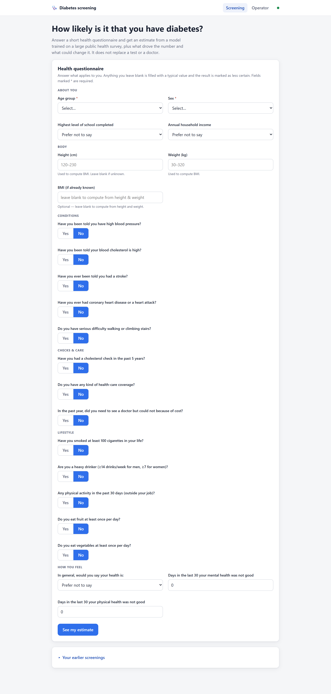{width=60%}

*Hình D1 - Web tiểu đường: biểu mẫu nhập với một ví dụ hợp lệ đã điền.*

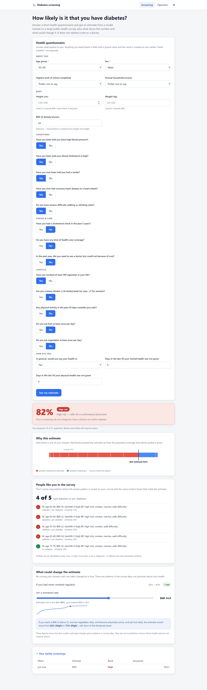{width=60%}

*Hình D2 - Web tiểu đường: màn hình kết quả - 82 % nguy cơ cao, SHAP force plot, năm người
trả lời khảo sát tương tự nhất, và một thanh trượt what-if BMI.*

**Giải thích hình (D1-D2).** Người dùng trả lời biểu mẫu (D1); trường trống được
median-impute. Dịch vụ trả về `p(diabetes) = 0.82` và trang (D2) hiển thị mức "Nguy cơ cao -
đi xét nghiệm máu xác nhận", một SHAP force plot cho biết câu trả lời nào đẩy ước lượng, năm
người trả lời khảo sát tương tự nhất, và một thanh trượt what-if BMI - một xác suất cao
nhưng chưa chắc chắn được cố tình đưa ra dưới dạng "đi xét nghiệm", không phải một chẩn đoán.
Route `/docs` ghi lại cùng schema request và response.

### D.2 Ứng dụng Web - Giá nhà

| Mục | Giá trị |
|---|---|
| Framework | React 18 + TypeScript + Vite; `axios` |
| Endpoint API | `POST http://localhost:8002/predict` |
| Biến đầu vào | `Area` (bắt buộc, m^2); tùy chọn `Width, Length, Bedrooms, Bathrooms, Floors, "Alley Width", "Agent Listing Count", "Property Type", Position, Direction, "Road Type", Province, "Agent Role", district` |
| Quy tắc validation | schema Pydantic - bắt buộc `Area > 0`; số tùy chọn thiếu được median-impute; danh mục lạ ánh xạ về một hàng one-hot toàn 0 |
| Tiền xử lý dùng | `ColumnTransformer` đã lưu - `SimpleImputer(median) -> log1p -> StandardScaler` (số), `OneHotEncoder(handle_unknown="ignore", min_frequency=50)` (phân loại); không bao giờ fit lại |
| Mô hình đã nạp | `RandomForestRegressor` huấn luyện trên `log1p(Price)`; response nghịch đảo bằng `expm1` |
| Ví dụ request | `{ "Area": 78.7, "Width": 4.0, "Bedrooms": 3, "Bathrooms": 2, "Floors": 2, "Property Type": "house", "Province": "an-giang", "district": "Rach Gia" }` |
| Ví dụ response | `{ "predicted_price": 2540.82, "price_per_m2": 32.28, "currency": "million VND", "model": "RandomForest", "contributions": [ ... ] }` |

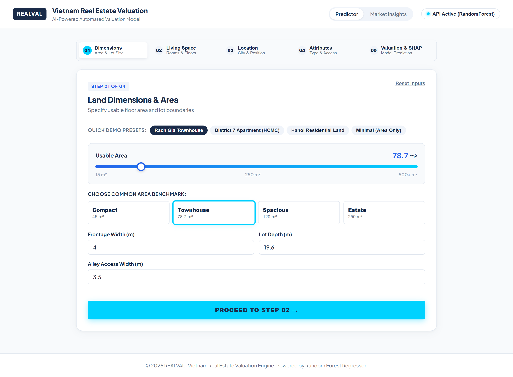{width=60%}

*Hình D3 - Web giá nhà: bước 1 của wizard định giá với preset "District 7 Apartment" đã
điền.*

{width=60%}

*Hình D4 - Web giá nhà: màn hình kết quả - dự đoán khoảng 9.90 tỷ VND, một khoảng thấp-cao,
một biểu đồ waterfall đóng góp SHAP và một tóm tắt bằng ngôn ngữ đời thường.*

**Giải thích hình (D3-D4).** Người dùng nhập thuộc tính bất động sản (D3; chỉ `Area > 0` là
bắt buộc). Dịch vụ trả về `predicted_price` và trang (D4) hiển thị khoảng 9.90 tỷ VND (khoảng
151 triệu VND/m^2) với một khoảng thấp-cao và một waterfall SHAP (diện tích sử dụng +3 381 M,
vị trí +2 093 M, ...); mô hình dự đoán `log1p(Price)` và response nghịch đảo bằng `expm1`.

### D.3 Ứng dụng Web - Hành vi khách hàng

| Mục | Giá trị |
|---|---|
| Framework | React 18 + Vite, wizard 3 bước; dev server proxy `/api` sang FastAPI |
| Endpoint API | `POST http://localhost:8000/predict` (cũng `/predict/batch`, `/questions`, `/samples`) |
| Biến đầu vào | `skin_type, skin_tone, eye_color, hair_color, secondary_category, brand_name, price_usd, loves_count, reviews, review_title, review_text` - điểm sao `rating` không bao giờ được gửi |
| Quy tắc validation | schema Pydantic; trường hồ sơ da trống ánh xạ về mức one-hot `__na__`; khoảng trống số được median-impute |
| Tiền xử lý dùng | `ColumnTransformer` đã lưu (`SimpleImputer(median) -> log1p -> StandardScaler`, nhị phân passthrough, `OneHotEncoder(min_frequency=25)`) cộng `TfidfVectorizer(ngram_range=(1,2), min_df=10, max_features=40000, sublinear_tf, stop_words="english")`; tất cả fit chỉ trên tập train |
| Mô hình đã nạp | `LogisticRegression(C=1.0, class_weight="balanced")` trên ma trận tabular + TF-IDF đã ghép |
| Ví dụ request | `{ "skin_type": "oily", "secondary_category": "Moisturizers", "brand_name": "Murad", "price_usd": 49, "review_title": "New formula is awful", "review_text": "Broke me out within a week and left me greasy all day ..." }` |
| Ví dụ response | `{ "prediction": "not recommend", "p_recommend": 0.0026, "threshold": 0.5, "review_terms": {"against": [...], "toward": [...]}, "signals": {...}, "contributions": [...], "model": "LogisticRegression", "representation": "tabular + tfidf" }` |

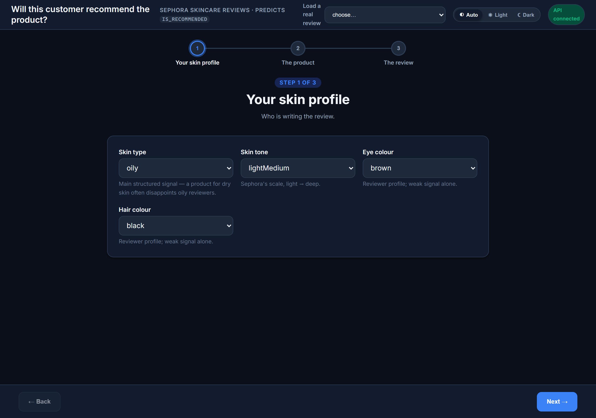{width=60%}

*Hình D5 - Web hành vi khách hàng: bước 1 (hồ sơ da) của wizard 3 bước, "API connected".*

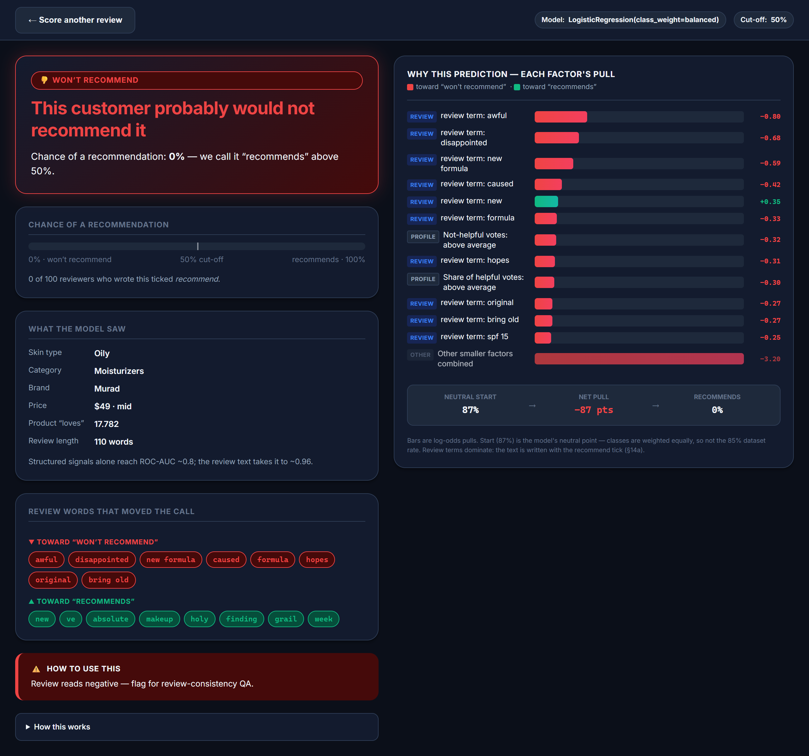{width=60%}

*Hình D6 - Web hành vi khách hàng: màn hình kết quả - "WON'T RECOMMEND", P(recommend) = 0 %,
thanh xác suất, tín hiệu có cấu trúc, các từ trong đánh giá, biểu đồ linear-SHAP.*

**Giải thích hình (D5-D6).** Một wizard 3 bước (D5): hồ sơ da, rồi sản phẩm, rồi tiêu đề và
nội dung đánh giá; điểm sao không bao giờ được gửi. Dịch vụ trả về `prediction = "not
recommend"`, `p_recommend = 0.00`, và trang (D6) hiển thị "WON'T RECOMMEND", một thanh xác
suất so với ngưỡng cắt 50 %, các tín hiệu có cấu trúc, các từ trong đánh giá đã tác động đến
phán quyết, và một biểu đồ linear-SHAP chính xác - một đánh giá đọc có vẻ tiêu cực bị đánh
dấu để QA nhất quán đánh giá.

## Phụ lục E - Báo cáo Ứng dụng Mobile

Cả ba client mobile là ứng dụng Flutter đóng vai trò client REST của dịch vụ đã triển khai
(`Training != Inference`): chúng thu thập cùng các trường như biểu mẫu web, `POST` chúng đến
`/predict`, và render JSON trả về. Mỗi lần chạy chụp ảnh dưới đây đều ghi một
`POST /predict 200` trên server - bằng chứng giao tiếp bắt buộc. (Ảnh được chụp từ ứng dụng
Flutter build cho web và chạy ở viewport điện thoại 390 x 844.)

| Mục | Tiểu đường | Giá nhà | Hành vi khách hàng |
|---|---|---|---|
| Framework mobile | Flutter 3.x / Dart, Material 3 | Flutter 3.x / Dart, Provider state | Flutter 3.x / Dart |
| Nền tảng | Android (emulator / thiết bị) | như trên | như trên |
| Màn hình nhập | biểu mẫu About-you / Body / Conditions, "Not sure" cho mục chưa biết | biểu mẫu cuộn đơn: diện tích, phòng, tỉnh/quận, loại | wizard 3 bước: hồ sơ da / sản phẩm / đánh giá |
| Endpoint API | `POST http://10.0.2.2:8000/predict` (emulator) / `localhost:8000` | `.../:8002/predict` | `.../:8000/predict` |
| Định dạng request | JSON body các trường trên (cùng khóa với biểu mẫu web) | JSON body (`Area` bắt buộc) | JSON body (không `rating`) |
| Định dạng response | `{ prediction, confidence, band, contributions }` | `{ predicted_price, price_per_m2, currency, model }` | `{ prediction, p_recommend, threshold, review_terms, signals, contributions }` |
| Hiển thị dự đoán | xác suất + mức nguy cơ + thanh "Why this score" + người tương tự | giá dự đoán (tỷ VND) + đơn giá + tóm tắt một dòng | phán quyết + thanh xác suất + tín hiệu + các từ trong đánh giá |

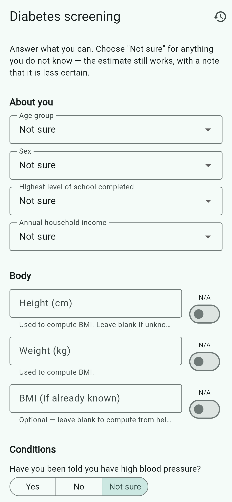{width=42%} 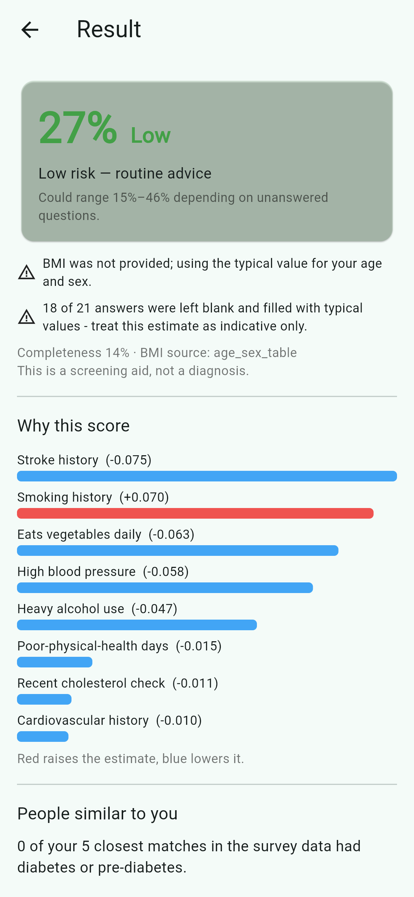{width=42%}

*Hình E1-E2 - Mobile tiểu đường: màn hình nhập (About you / Body / Conditions) và màn hình
kết quả (27 % Low, khoảng 15-46 %, thanh "Why this score"). Lần chạy đã ghi `POST /predict
200`.*

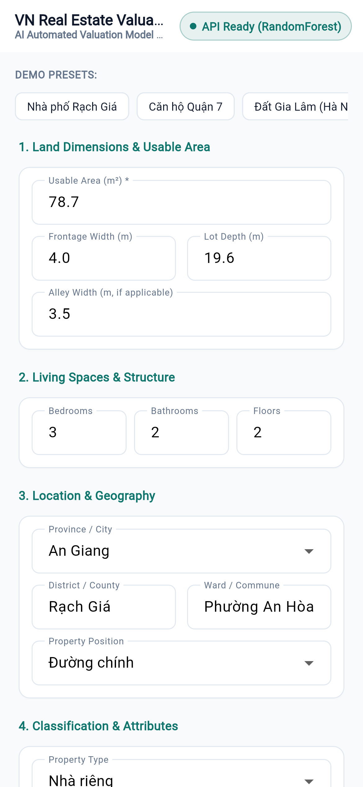{width=42%} 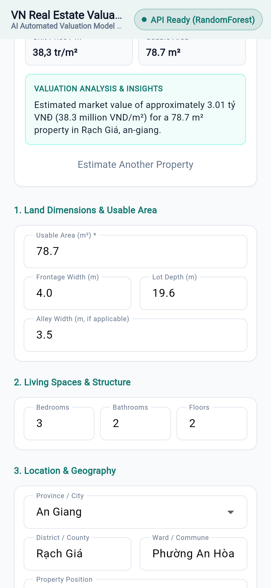{width=42%}

*Hình E3-E4 - Mobile giá nhà: màn hình nhập (preset Rạch Giá, "API Ready") và màn hình kết
quả (khoảng 3.01 tỷ VND, thẻ đơn giá, tóm tắt một dòng). Lần chạy đã ghi `POST /predict
200`.*

{width=42%} 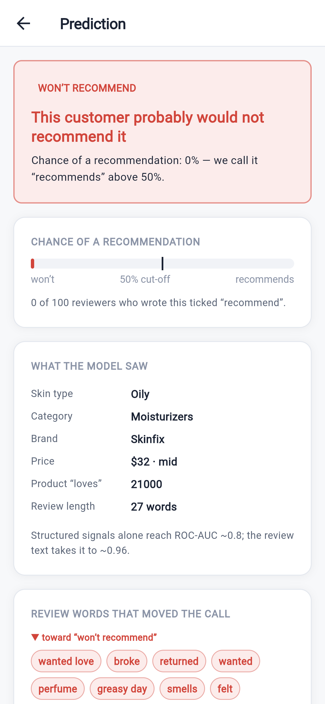{width=42%}

*Hình E5-E6 - Mobile hành vi khách hàng: bước 1 (hồ sơ da, "API connected") và màn hình kết
quả ("WON'T RECOMMEND", thanh 0 %, tín hiệu, các từ trong đánh giá). Lần chạy đã ghi `POST
/predict 200`.*

**Giải thích hình (E1-E6).** Mỗi màn hình nhập thu thập cùng các trường như biểu mẫu web
tương ứng; khi submit, ứng dụng dựng một JSON body và gọi `POST .../predict` qua HTTP. Mỗi
màn hình kết quả render JSON trả về - cùng payload mà trang web nhận được - dưới dạng một xác
suất / giá trị dự đoán kèm một diễn giải ngắn. Dòng `POST /predict 200` ghi trên server
trong mỗi lần chạy là bằng chứng client mobile giao tiếp với dịch vụ đã triển khai.

## Phụ lục F - Checklist Nộp bài và Bằng chứng Bổ sung

### F.1 Checklist nộp bài

| Yêu cầu | Xong |
|---|---|
| Chọn ba bộ dữ liệu Kaggle | Có |
| Hoàn thành ứng dụng Tiểu đường / Giá nhà / Hành vi khách hàng | Có / Có / Có |
| Định nghĩa bài toán cho cả ba | Có |
| Phân tích cấu trúc dữ liệu, chất lượng dữ liệu, giá trị thiếu, dòng trùng, giá trị không hợp lệ, outlier | Có |
| Giải thích biểu diễn dữ liệu; nhận diện đặc trưng số và phân loại; giải thích feature engineering | Có |
| Hoàn thành EDA | Có |
| Chia tập train / validation / test đúng cách; đã xét rò rỉ dữ liệu | Có |
| Cài đặt pipeline tiền xử lý (fit chỉ trên train, đã lưu) | Có |
| So sánh ít nhất bốn mô hình ML mỗi ứng dụng (5 / 5 / 8) | Có |
| Báo cáo chỉ số phù hợp; báo cáo ma trận nhầm lẫn khi thích hợp | Có |
| Chọn và biện minh mô hình tốt nhất; hoàn thành phân tích lỗi | Có |
| Lưu mô hình; lưu tiền xử lý; đã test suy luận | Có |
| Cài đặt REST API | Có |
| Cài đặt ứng dụng web; kèm ảnh chụp web (cả ba) | Có (Phụ lục D) |
| Cài đặt ứng dụng mobile; kèm ảnh chụp mobile (cả ba) | Có (Phụ lục E) |
| Kèm thông tin khả năng tái lập | Có (Mục 9) |
| Nộp mã nguồn; kèm README | Có |
| Kèm thảo luận so sánh tổng kết | Có (Mục 7, 10) |
| Nộp PDF cuối cùng | (tạo từ tài liệu này) |

### F.2 Bằng chứng notebook bổ sung

Đầu ra của `df.shape` / `df.info()` / `df.describe()` / `df.isna().sum()` /
`df.duplicated().sum()` được lập bảng với giá trị đã chạy thực tế ở Mục 4.3, 5.3 và 6.2; các
cell notebook thô nằm trong ba file `*/notebook/*.ipynb`, chạy từ trên xuống dưới không có
cell lỗi. Các biểu đồ hỗ trợ Mục 10.1-10.3 của giá nhà (phân phối diện tích / đơn giá, thanh
tỷ số tương quan, góc nhìn thiếu dữ liệu và QQ) cùng các biểu đồ outlier Mục 9 nằm trong các
notebook và không tái hiện ở đây.

### F.3 Tái lập và chỉ mục file

Toàn bộ ảnh chụp, và các cổng mà mỗi stack đã chạy, được lập chỉ mục trong
`report/screenshots/README.md`. Các stack được chạy cục bộ vào 07/09/2026: backend FastAPI +
Uvicorn, dev server web React/Vite, và client Flutter build cho web (`flutter build web`)
chạy ở viewport 390 x 844. Cổng backend: tiểu đường 8000, giá nhà 8002, hành vi khách hàng
8000. Ba notebook chạy từ trên xuống dưới với `RANDOM_SEED = 42` và ghi `model/` trước khi
khởi động API.
